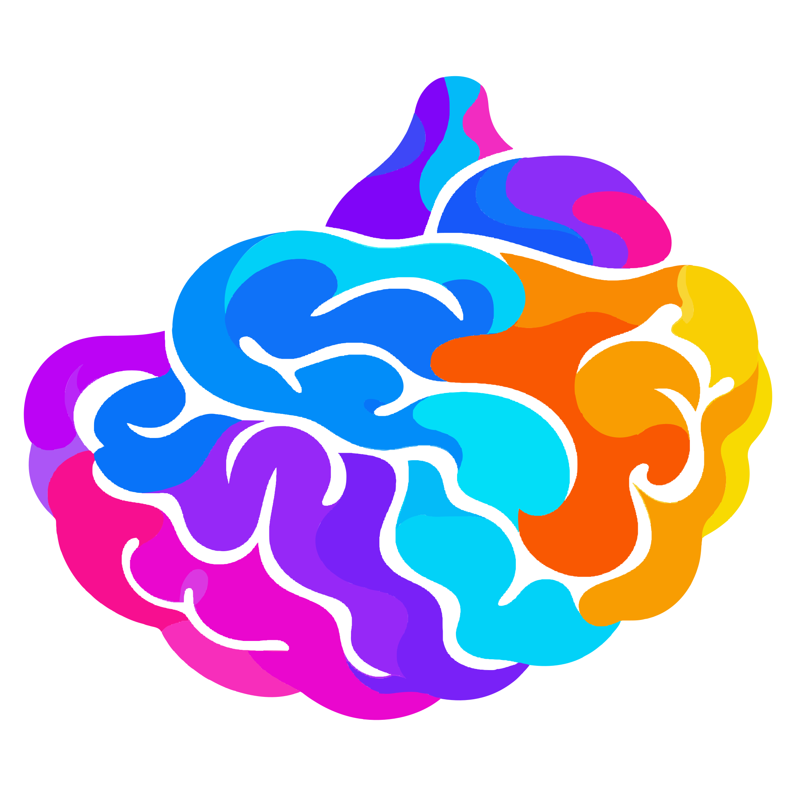

<p align="center">
  
</p>

# brainless

**Notes arrive from everywhere, collect in one place, link themselves to each other, and
come back to you when they are relevant. Then they argue with you.**

It runs on your own machine. A folder of plain text notes, a handful of small scripts and
whichever AI model you point them at. No server, no account, nothing to sign up for. Your
notes stay in your folder, on your disk, in a format you could still open in twenty
years.

Sherlock had the method. Watson wrote it down, asked the obvious question, and kept the
files. This is the Watson. You keep the method.

---

## The problem

My notes were scattered across six places. Voice notes to myself in the car. Screenshots
on the phone. Meeting transcripts in e-mail. Articles I meant to return to. Half a
thought typed into a chat window at midnight. Each one was written down somewhere and
then effectively gone, because "I wrote that down" and "I can find it again" are not the
same sentence. I lost weeks to hunting for things I already knew.

The second problem was worse. I run a company, so my days are decisions, most of them
made on a phone between two meetings and never looked at again. That is how you get to be
wrong the same way twice without noticing.

A pile of notes does not fix it. Notes that nobody reads are a warehouse. Summaries that
nobody argues with are a tidier warehouse. And an argument that nobody grades is
entertainment, which Galatasaray already provides.

## The solution

One loop, and each part is there because the one before it is useless alone. Collect
everything without judging it. Let the machine read it and make the connections. Argue
with what you are about to decide. Write the decision down as a bet, and settle the bet
later. Then keep the promises you made along the way.

The bet underneath it all is connectivity. A note on its own is storage. Notes wired to
each other are a map, and the value shows up when you move across it: an argument from a
meeting in May lands beside a belief written in March, and the two change each other.

The notes were a warehouse. What I wanted was a colleague.

### 1. Gather information

**Everything comes in through one door.** A voice note, a photo of a handwritten page, a
link, a PDF, a meeting transcript, a line typed on the phone. It all becomes a note in the
same folder. Nothing is tagged, filed or judged on the way in. Judging a thought at
capture time is how good ones die in a car park.

A YouTube video or a podcast episode comes back as a transcript with the time every few
minutes, transcribed on my own machine, so an hour of talk is no longer gone by Friday.
Years of chat history can come in too, filtered first, because most of it is lookups and
the rest is the most private thing I own.

**Then the machine reads it so I do not have to.** A pile of captures is only useful if
somebody reads it, and I was never going to be that somebody. Every note is summarised
and linked to the people, companies and ideas it mentions. An idea that keeps coming back
gets a page of its own, and every new source improves that page instead of piling up
beside it. When two sources disagree, the page keeps both, with dates. A claim that went
out of date is struck through, not deleted, because what I used to believe and why is the
part a search engine cannot give me. Nobody has to spend a Sunday curating a knowledge
graph.

**The connections get made for me.** A note from last year turns up beside the thing I am
looking at today because they share a subject, not because I remembered to link them. I
do not make the links any more, and the links are better for it, because the system has
no favourites and never conveniently forgets the note that undermines the plan I am
attached to.

### 2. Think deeper and clearer

**Ask what you already know.** Before anything hard, one search answers "what have I
already written about this", including the parts I had forgotten writing. Every answer
cites the page it came from and ends with what the vault does not cover. Before a
meeting, a short brief. Overnight, a digest of the day. And every night the same
twenty-odd questions with known answers are asked again, so I learn that search got
worse from a number, not from a bad answer on a bad day.

**Then let it argue.** Six personas, each built out of a book on thinking, test a thesis
in two rounds. In the first, each one works alone, blind to the others, and votes yes, no
or conditional with a probability. In the second, each reads the rest, answers the
strongest objection, votes again and names the evidence that moved it, or says "none".
A moderator then writes the best counterargument, what would have to be true, and a
cheap test with a date on it.

The voices come from the shelf.

| Persona | Book | What it asks |
|---|---|---|
| Skeptic | Browne and Keeley, *Asking the Right Questions* | What is the conclusion, what are the reasons, what is left out, what else could be true |
| Gambler | Annie Duke, *Thinking in Bets* | Write it as a bet. How confident, in a number. Twelve months on, it failed: why |
| Scientist | Camuffo, Gambardella et al., *A scientific approach to entrepreneurial decision-making* | What must be true, what is the cheapest test, what result means stop and what means pivot |
| Postmortem | Amy Edmondson, *Right Kind of Wrong* | If this fails, what kind of failure is it. Was the homework done. What is the smallest version |
| Strategist | Lafley and Martin, *Playing to Win* | Where to play, how to win, with which capabilities |
| Methodologist | Quivy and Van Campenhoudt, *Manuel de recherche en sciences sociales* | What is the real question underneath, and what observation would prove it wrong |

They never mention each other and only answer the moderator and you, so they cannot set
each other off. It is the best-behaved meeting in my week. And if they start agreeing
with me too often, a flag goes up. Six voices that always agree with you are a fan club,
and I did not need software for that.

Nothing here makes you smarter. It changes what you have to write down before you may
move on, and the order you see things in. Criteria before options, so a favourite cannot
write its own test. A number before a feeling. Readings taken blind, so the first voice
does not set the room. One dated action at the end, so a decision cannot pass as an
opinion.

### 3. Decide

Reading is still not thinking. The machine can tell you what you wrote, but not what you
hold to be true, so that part is written by hand. A belief carries a line for "what would
change my mind". A decision carries a prediction, a confidence and a review date.

The format matters more than it looks. A bet can lose, and something that can lose can be
argued with.

It never picks for you. When a review date passes, it nags until you write down what
actually happened. Ten years of ungraded decisions is one year repeated ten times. If you
do only this step, you are ahead of most people I know. Including me, for most of this
year.

Every answer, graded or not, is filed back into the vault. That is where the loop closes,
because tomorrow's question gets to build on today's answer.

### 4. Bonus: get shit done

Decisions come with promises attached, and promises are the first thing to fall out of a
busy head.

- **Promises become tasks by themselves.** What I say I will do in a meeting or a voice
  note is picked up, checked against what is already on the list so the same job is not
  written down three times in three different wordings, and synced with Google Tasks both
  ways.
- **Every morning, at most three things.** A decision due for grading, the oldest promise
  still open, and one piece of evidence worth a second look, each with a link to where it
  came from. Answer it, push it to a date, or drop it with a reason.
- **It asks, I answer, in a thread.** Reminders, the morning three and the weekly
  question arrive on my phone. I reply the way I would reply to a colleague. "Apply"
  writes the note. "Defer to Friday" moves it. Nothing is written into my notes until I
  say so.

---

## How I use it on an ordinary day

- **All day, with no effort.** I send things to a bot on my phone: a voice note in the
  car, a photo of a whiteboard, a link. That is the whole capture ritual. No folders, no
  tags, no inbox to process later.
- **Before anything hard.** I ask what I have already written about the subject. Before a
  real decision, I hand the thesis to the six voices and read what comes back.
- **Morning.** The night is already compiled. At most three things are waiting.
- **Overnight, without me.** An always-on machine digests the day, rebuilds everything
  and runs the six voices at 12:30 and 21:20.

## What it changed

I stopped carrying it all in my head, which was the whole point.

The part that pays for the whole thing: the first run, on 9 September 2026, found that my
argument against a partner's equity ask was aimed at the wrong object. I would have walked
into that meeting confidently wrong, which is the expensive way to be wrong.

## Keep it yours

A loop that runs unattended against a folder holding your life needs one rule above all
the others: nothing writes into your notes without you. The machine proposes and you
apply.

- Everything runs on your own hardware. The only thing that ever leaves the machine is a
  question to the model you chose, and pointing it at a model on your own computer keeps
  even that at home.
- Folders you mark private, like health or identity papers, are never read by the model.
- The rules are checks, not requests. A write into your own folders asks you first. A
  deletion asks. A secret or a bank number never lands in a file. A page where the model
  talked about itself instead of your source is refused.
- Once a month the whole vault, history included, is sealed with a key the machine cannot
  open and put somewhere sync does not reach. A restore test proves it comes back. Sync is
  not backup: a bad night copies itself everywhere in minutes.
- The engine and the notes are separate, so you can share one and keep the other. This
  public repo contains no notes at all.

## Where this came from

On the evening of 8 September 2026 I sent myself two voice notes from the car. The first
said the notes I take all day should argue with each other at night. The second said this
thing should be installable by someone who is not me.

I had the vault already. I had beliefs written down. I had decision notes with a "review
date" field that nobody ever reviewed, least of all me. So I put five books on a shelf and
turned each one into a voice that reads my day and pushes back. The first round ran the
next day at 12:30. Five voices, ten replies, one synthesis, one bet. The sixth voice came
later.

The name came earlier, and it is a joke that stuck. I kept telling the company "let us
use our own brain first, then we can talk about a second brain", so when the folder
needed a name I typed brainless: not a second brain, zero brain. It turned out to carry
the design rule. The system keeps the memory and the connections. The thinking stays
yours.

## Who this is for

People who make decisions for a living and suspect their own reasoning. Founders,
operators, product people, anyone whose calendar is a sequence of judgement calls.

It helps if you already write things down. It helps more if you are willing to be told
you are wrong by a script at 21:20.

## What it is not

- Not a chat app, although it is getting conversational. The notes are still the record.
  The threads are how the record gets made.
- Not a knowledge graph you maintain. The graph is built for you, not curated by you.
  It does get measured: how many pages nothing links to, how many hang together, which
  pages hold two clusters together. The numbers go into the health report every week.
- Not a decision maker. It never picks. Duke would call that resulting in advance.
- Not finished. I built it for one person, then made it installable in a day. Expect
  rough edges, and tell me where they are.

---

## Install

Requirements: git, Python 3.10 or newer, and one LLM backend.

```bash
curl -fsSL https://raw.githubusercontent.com/ezapmar/brainless-public/main/install.sh | bash
```

Yes, that is curl piped into bash, on a page with a whole section about trust. The
script is short enough to read first, and I would. What it does, in order:

1. Checks git and Python.
2. Clones the engine into `~/brainless`. Pass `--vault <dir>` for another place.
3. Creates `.venv` and installs the one core dependency, the document converter.
4. Checks the LLM backend. Default is the `claude` CLI signed in with a subscription.
   Any OpenAI-compatible endpoint works instead: OpenAI, Together, Grok, Ollama, LM
   Studio. Set `BRAINLESS_LLM_PROVIDER=openai-compatible`, `BRAINLESS_LLM_BASE_URL` and
   `BRAINLESS_LLM_MODEL`. A third option, `goose`, runs a model on the machine itself
   through the Goose CLI, and routing is per lane, so the private short prompts can stay
   local while long prose goes to a large model. See
   [Local Inference](https://github.com/ezapmar/brainless-public/wiki/Local-Inference).
5. Asks your first name and output language, `en` or `tr`, and writes
   `_Agent-Context/PROFILE.md`.
6. Installs the `brainless` command into `~/.local/bin`.
7. Runs a dry compile as a smoke test.

It is safe to re-run. Add `--schedule` to install the hourly conversion, the nightly
digest and the weekly lint, as launchd agents on macOS and systemd user timers on Linux.
Add `--yes` to skip the questions.

**Optional inputs.** Step 3 covers documents: markitdown is installed with its PDF, DOCX,
XLSX and PPTX extras, so a dropped file becomes Markdown with nothing more to install.
The other doors need something extra on the machine that runs the capture:

- **Voice** needs `ffmpeg` and [whisper.cpp](https://github.com/ggml-org/whisper.cpp)
  with a model file (this vault runs `large-v3-turbo`). Transcription stays on the
  machine; only the cleaned text reaches a model. Without them, voice notes are kept as
  audio and not transcribed.
- **Photographs** are read by the vision lane of whichever backend you configured
  (`capture-photo` in `tools/llm.py`), so a backend without vision means no OCR. A local
  OCR option is on the list in [Local Inference](https://github.com/ezapmar/brainless-public/wiki/Local-Inference).

- **YouTube and podcasts** need [yt-dlp](https://github.com/yt-dlp/yt-dlp) for captions,
  plus the same `ffmpeg` and whisper.cpp for episodes without them. Share an episode link,
  not a show link.
- **Backups** need [age](https://github.com/FiloSottile/age). Put the public key in
  `PROFILE.md` and keep the private one in your password manager.

None is required to start: text, links, documents and the whole compile loop work
without them. How each door is wired is in [Capture Flow](https://github.com/ezapmar/brainless-public/wiki/Capture-Flow).

To run the script with options instead of piping it:

```bash
git clone https://github.com/ezapmar/brainless-public.git ~/brainless
bash ~/brainless/install.sh --vault ~/brainless --schedule
```

## The first ten minutes

```bash
brainless compile --dry-run                      # what would be compiled
brainless compile                                # build .wiki/
brainless search "the thing you keep thinking about"
brainless dialectic "We should hire before we have the revenue"
brainless calibrate                              # decisions due for grading
```

That is the start. The whole shell command, from `brainless help`:

```text
compile    build .wiki/ from your notes (--dry-run, --full-rebuild, --only <phase>)
search     search the compiled wiki
dialectic  six personas argue a thesis; --scorecard prints the rolling 30 day scorecard
lint       wiki integrity checks and repairs (--fix, --fix-links)
calibrate  decisions due for grading, decisions missing a prediction
today      preview, save (--build) or send (--send) the three-item Today queue
closeout   evening close-out: one seed, one decision, one contradiction
digest     nightly digest of Thinking/Daily, archives the raw captures
dashboard  rebuild the projects view from every notes.md
health     refresh and print _Agent-Context/HEALTH.md
file       file a result into .wiki/digests/queries/ so the wiki compounds
media      queue YouTube and podcast links, work the transcript queue
backup     monthly encrypted archive, restore test, status
graph      the link graph as a Gephi file
eval       ask the golden questions and score the search
chats      bring Claude or ChatGPT history in, filtered
export     produce the public engine tree from a private vault
update     git pull and refresh dependencies
vault      print the vault path
version    print the engine version
```

The personas are only as good as what they have to argue with, so give them something.
Open `_Templates/`. Copy `Belief.md` into `Thinking/Beliefs/` and write one thing you
believe about your work. Copy `Decision.md` into `Thinking/Decisions/` for the last real
decision you made, with a prediction and a date. One belief and one decision are enough
to start a fight.

Inside Claude Code or Gemini CLI, from the vault root, the thinking tools are slash
commands. Fifteen of them, in three groups:

- **Deciding:** `/decide`, `/dialectic`, `/contradict`, `/calibrate`
- **Thinking:** `/ideas`, `/pollinate`, `/trace`, `/connect`, `/weekly`, `/context`
- **Tending the vault:** `/graduate`, `/backlog`, `/sync`, `/lint`, `/recompile`

Their definitions live in `.wiki/_commands/`, one Markdown prompt each, and the
`.claude/commands/` and `.gemini/commands/` wrappers only point back there, so they work
with any agent that can read files. What each one asks, and the thinking error it is
built against: [Commands](https://github.com/ezapmar/brainless-public/wiki/Commands).


---

## Learn more

The full story, with the mechanics and the file names, lives in the
[wiki](https://github.com/ezapmar/brainless-public/wiki).

- [How it works](https://github.com/ezapmar/brainless-public/wiki/How-It-Works): the loop step by step, the privacy rules, the addons
  and the exact setup I run.
- [The Loop](https://github.com/ezapmar/brainless-public/wiki/The-Loop) and [Method](https://github.com/ezapmar/brainless-public/wiki/Method): how a note moves from capture to
  decision, and why judging is postponed at each step.
- [Personas and Dialectic](https://github.com/ezapmar/brainless-public/wiki/Personas-and-Dialectic): the six voices and the two rounds.
- [Thinking Clearer](https://github.com/ezapmar/brainless-public/wiki/Thinking-Clearer) and [Commands](https://github.com/ezapmar/brainless-public/wiki/Commands): each mechanism,
  and every command with what it guards against.
- [Today Queue](https://github.com/ezapmar/brainless-public/wiki/Today-Queue) and [Buzz Interactions](https://github.com/ezapmar/brainless-public/wiki/Buzz-Interactions): the
  morning three and the threads.
- [References](https://github.com/ezapmar/brainless-public/wiki/References): the books, papers and tools it is built on.

## Honest limits

- The default path assumes a Claude subscription. Other providers work but I have tested
  them less, and reading handwriting and whiteboard photos only works with Claude for
  now. Text, voice and documents are fine.
- It speaks English and Turkish out of the box. Another language is a new folder of
  labels.
- The six personas are my shelf. Yours may be different, and should be.
- I am not a decision scientist. I am an operator who got tired of being wrong in the
  same way twice.

## Contributing

Issues and pull requests are open. If a persona gave you a bad argument, paste the
thread. If the installer broke on your machine, paste the output. Both are more useful
than a feature request.

The regression tests run offline, with no credentials and no model calls:

```bash
python3 -B -m unittest discover -s tools/tests -v
```

## Licence

MIT. See `LICENSE`.

---

Capture everything. Argue at night. Grade yourself in the morning.
