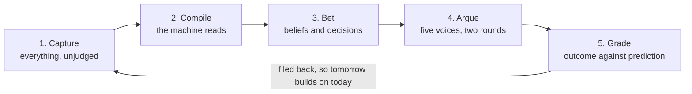
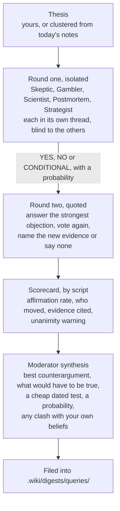
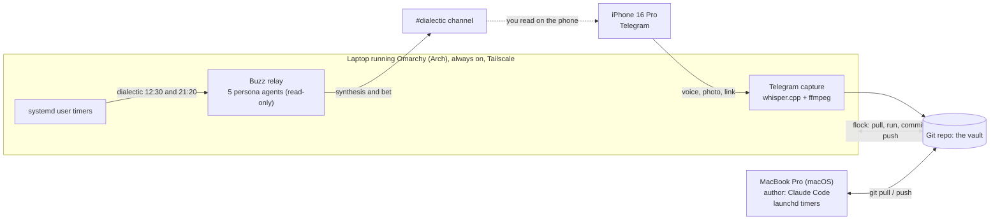

# brainless

**Watson for curious minds. A helper for decision makers.**

Sherlock had the method. Watson wrote it down, asked the obvious question, and kept the
files. This is the Watson. You keep the method.

---

## Where this came from

On the evening of 8 September 2026 I sent myself two voice notes from the car. The first
said the notes I take all day should argue with each other at night. The second said
this thing should be installable by someone who is not me.

I run a company. Kolay İK is an HR platform out of Istanbul, with 2,600 companies and
300,000 employees on it. My days are decisions, most of them made on a phone between two
meetings, and most of them never revisited. I had a vault of notes. I had beliefs
written down. I had decision notes with a "review date" field that nobody ever reviewed,
least of all me.

The notes were a warehouse. What I wanted was a colleague.

So I put five books on a shelf (Browne and Keeley, Annie Duke, Camuffo and Gambardella,
Amy Edmondson, Lafley and Martin) and turned each one into a voice that reads my day and
pushes back. The first round ran on 9 September at 12:30. Five voices, ten replies, one
synthesis, one bet. It found that my argument against a partner's equity ask was aimed
at the wrong object. I would have walked into that meeting confidently wrong, which is
the expensive way to be wrong.

That is the whole product. Everything else is plumbing, and the rest of this page is
mostly about the plumbing.

---

## The loop

brainless is one loop, and each part is there because the one before it is useless
alone. Notes that nobody reads are a warehouse. Summaries that nobody argues with are a
tidier warehouse. And an argument that nobody grades is entertainment, which Galatasaray
already provides.



### 1. Capture everything, filter later

Handwritten pages, voice notes, photos, links, documents, half sentences, Telegram
messages and Buzz `#inbox` posts all come in through the same wide front door. They land
in `Inbox/`, `Inbox/Links/` and `Thinking/Daily/` as Markdown, and nothing is judged on
the way in. Judging a thought at capture time is how good ones die in a car park. The
[capture flow guide](docs/capture-flow.md) maps every entrance and every scheduled job.

### 2. Let the machine read so you do not have to

A pile of captures is only useful if somebody reads it, and I was never going to be that
somebody. So a compiler turns every note into a summary, clusters summaries into
articles, mirrors project status and writes a daily digest into `.wiki/`. Documents keep
their originals and their raw Markdown conversions. The high-value ones also get a
Summary and a Fiche de Lecture, and a missing or empty output is retried instead of
quietly accepted.

Obsidian is the surface. Every input becomes Markdown, Graph view follows the explicit
`[[wikilinks]]`, and Smart Connections shows related notes that do not have a written
edge yet. You own the notes. The machine owns `.wiki/` and can rebuild it from scratch
whenever it likes, which means nobody has to spend a Sunday curating a knowledge graph.

### 3. Write what you believe and what you decided, as bets

Reading is still not thinking. The compiled layer can tell you what you wrote, but it
cannot tell you what you hold to be true, so that part is typed by hand. Beliefs live in
`Thinking/Beliefs/`, each with a line for "what would change my mind". Decisions live in
`Thinking/Decisions/`, each with a prediction, a confidence and a review date.

The format matters more than it looks. A bet can lose, and something that can lose can
be argued with.

### 4. Argue before you act

Five personas test a thesis in two rounds. In round one each persona gets its own
thread, applies its own method without seeing the others, and votes YES, NO or
CONDITIONAL with a probability. In round two each reads the rest, picks the strongest
objection, answers it, votes again and names the new evidence that moved it, or says
"none".



A script scores the round before the moderator writes a word, so the synthesis starts
from counted votes and not from a mood. A rolling 30 day scorecard raises a flag when
affirmation climbs above 60 per cent, or when a persona never votes NO. Five voices that
always agree with you are a fan club, and I did not need software for that.

The voices come from the shelf.

| Persona | Book | What it asks |
|---|---|---|
| Skeptic | Browne and Keeley, *Asking the Right Questions* | What is the conclusion, what are the reasons, which words are ambiguous, what is omitted, what other conclusions are possible |
| Gambler | Annie Duke, *Thinking in Bets* | Write it as a bet. How confident, in a number. Is this outcome or decision quality. Twelve months on, it failed: why |
| Scientist | Camuffo, Gambardella et al., *A scientific approach to entrepreneurial decision-making* | What is the theory, what must be true, what is the cheapest test, what result means terminate and what means pivot |
| Postmortem | Amy Edmondson, *Right Kind of Wrong* | If this fails, is it basic, complex or intelligent failure. Was the homework done. What is the smallest version |
| Strategist | Lafley and Martin, *Playing to Win* | Where to play, how to win, which capabilities, which systems. Passes on topics that are not strategy |

They never mention each other and only answer the moderator and you, so agents cannot
set each other off. It is the best-behaved meeting in my week. Each persona's prompt is
a Markdown file in `.agents/buzz/personas/`. Edit them. Add a sixth. The moderator does
not care how many there are.

### 5. Grade yourself

An argument ends in a bet, and a bet is worth nothing until somebody settles it. When a
review date passes, the system nags until you write the outcome. `brainless calibrate`
lists what is due, and the [Today queue](docs/today-queue.md) keeps the daily ask small.
`brainless today` offers at most three items: a decision, a commitment and one piece of
evidence to review, each with a link to its source. Answers are previews until you apply
them. You can defer an item to a date or dismiss it with a reason, and the existing
morning worker sends the queue over Telegram, so there is no new timer to install.

Ten years of ungraded decisions is one year repeated ten times. If you do only this
step, you are ahead of most people I know. Including me, for most of this year.

Every analysis, graded or not, is filed back into `.wiki/digests/queries/`. That is
where the loop closes, because tomorrow's question gets to build on today's answer.

---

## Keep it yours

A loop that runs unattended against a folder holding your life needs one rule above all
the others, which is that nothing writes into your notes without you. Every command
proposes and you paste. Private folders never reach the compiled layer. The engine and
the notes are separate repos, so you can share one and keep the other.

The rule is enforced by who owns which folder.

| Folder | Owner | What lives there |
|---|---|---|
| `Work/`, `Personal/`, `Library/` | you | projects, life, reference material |
| `Inbox/` | you | unsorted capture, triaged later |
| `Thinking/` | you | `Daily/`, `Ideas/`, `Beliefs/`, `Decisions/`, calibration |
| `.wiki/` | the machine | compiled layer, regenerable, never hand-edited |
| `_Agent-Context/` | shared | `PROFILE.md`, context, tasks, health, the rules agents follow |
| `_Templates/` | shared | note templates |
| `tools/` | engine | compiler, lint, search, filer, calibration, dialectic |
| `.agents/` | engine | scheduled jobs, systemd units, persona definitions |

Every script in `tools/` and `.agents/scripts/` is described in the
[scripts reference](docs/scripts.md): what it is, what it does, and why it is built the
way it is.

A project is any folder under `Work/` or `Personal/` with a `notes.md`. Project mirrors
track changes across all permitted source files and exclude private descendants. Use
`## Next Action` in a project note for its next concrete step. `## Kill Criteria` stays
separate on the dashboard, because the condition under which you would stop is a
different thing from a task.

**The text-processing LLM never gets general file tools.** Context is embedded in the
prompt. It cannot read, write, move or delete anything. Image OCR is the narrow
exception, and even there the image reader receives only the specific image it needs.
That is the reason a script can run unattended against a folder that holds your life.

Inside that fence the LLM is the connective tissue of the loop. Local whisper.cpp
transcribes voice. Claude reads handwritten images and cleans the text, fixes names
against the current context, and adds links between a capture and the notes it touches.
The original image, source document or raw conversion stays recoverable, and a failed
model call does not erase the input.

Privacy follows from the same separation.

- The repo you clone contains no notes. Content folders are gitignored in the engine
  repo; your vault is wherever `BRAINLESS_VAULT` points.
- Identity papers, health folders and official documents are ignored anywhere in the
  tree by default. Add your own folder names to `private_segments` in `PROFILE.md` and
  they will never be compiled.
- This public repo is produced from my private vault by `tools/export_public.py`, a
  whitelist copy plus a leak scan that refuses to pass on identity numbers, keys, tokens
  or a name. If you fork this for your own vault, use the same script.

---

## Who this is for

People who make decisions for a living and suspect their own reasoning. Founders,
operators, product people, anyone whose calendar is a sequence of judgement calls.

It helps if you already write things down. It helps more if you are willing to be told
you are wrong by a script at 21:20.

## What it is not

- Not a chat app. You talk to it through notes, commands and, optionally, a channel.
- Not a knowledge graph you maintain. The graph is compiled, not curated.
- Not a decision maker. It never picks. Duke would call that resulting in advance.
- Not finished. I built it for one person, then made it installable in a day. Expect
  rough edges, and tell me where they are.

---

## Install

Requirements: git, Python 3.10 or newer, and one LLM backend.

```bash
curl -fsSL https://raw.githubusercontent.com/ezapmar/brainless-public/main/install.sh | bash
```

Yes, that is curl piped into bash, on a page with a whole section about trust. The
script is short enough to read first, and I would. What it does, in order:

1. Checks git and Python.
2. Clones the engine into `~/brainless`. Pass `--vault <dir>` for another place.
3. Creates `.venv` and installs the one core dependency, the document converter.
4. Checks the LLM backend. Default is the `claude` CLI signed in with a subscription.
   Any OpenAI-compatible endpoint works instead: OpenAI, Together, Grok, Ollama, LM
   Studio. Set `BRAINLESS_LLM_PROVIDER=openai-compatible`, `BRAINLESS_LLM_BASE_URL` and
   `BRAINLESS_LLM_MODEL`.
5. Asks your first name and output language, `en` or `tr`, and writes
   `_Agent-Context/PROFILE.md`.
6. Installs the `brainless` command into `~/.local/bin`.
7. Runs a dry compile as a smoke test.

It is safe to re-run. Add `--schedule` to install the hourly conversion, the nightly
digest and the weekly lint, as launchd agents on macOS and systemd user timers on Linux.
Add `--yes` to skip the questions.

To run the script with options instead of piping it:

```bash
git clone https://github.com/ezapmar/brainless-public.git ~/brainless
bash ~/brainless/install.sh --vault ~/brainless --schedule
```

## The first ten minutes

```bash
brainless help                                   # every command
brainless compile --dry-run                      # what would be compiled
brainless compile                                # build .wiki/
brainless search "the thing you keep thinking about"
brainless dialectic "We should hire before we have the revenue"
brainless calibrate                              # decisions due for grading
```

The personas are only as good as what they have to argue with, so give them something.
Open `_Templates/`. Copy `Belief.md` into `Thinking/Beliefs/` and write one thing you
believe about your work. Copy `Decision.md` into `Thinking/Decisions/` for the last real
decision you made, with a prediction and a date. One belief and one decision are enough
to start a fight.

Inside Claude Code or Gemini CLI, from the vault root, the same commands exist as slash
commands: `/decide`, `/contradict`, `/dialectic`, `/ideas`, `/weekly`, `/trace`,
`/connect`, `/graduate`, `/context`. Their definitions live in `.wiki/_commands/` and
work with any agent that can read files.

---

## Addons

The loop above runs on one laptop with none of these. Each one removes a specific
friction, and each needs its own credentials in `~/.config/brainless/`.

- **Telegram capture.** Voice notes, photos, links and text from your phone become
  `Thinking/Daily/` notes. Transcription runs locally with whisper.cpp.
- **Buzz personas.** The five voices as live agents on a self-hosted
  [Buzz](https://github.com/block/buzz) relay. They answer in a channel twice a day and
  whenever you mention them. This is how I run it; `.agents/buzz/` has the prompts and
  the installer.
- **Google Tasks and Calendar.** Two-way task sync and a brief before each meeting.
- **Meeting transcripts.** An IMAP ingest for meeting report e-mails.
- **CRM snapshot.** A read-only pull from your CRM (Pipedrive first; the provider
  seam in `.agents/scripts/crm_capture.py` takes others) into a status block the
  briefing copies and an event log per company under `Inbox/CRM/`. Organisation
  and deal level only, no people, no LLM. Drop your token in
  `~/.config/brainless/pipedrive_api_token`; without it the script is a no-op.
  Setup, flags, example output and the provider seam:
  [docs/addons/crm-pipedrive.md](docs/addons/crm-pipedrive.md).
- **An always-on worker.** A second machine that runs the timers, pulls, commits and
  pushes, so your laptop can sleep. The units in `.agents/systemd/` are built for it.

---

## Usage example: our real setup

This is the exact deployment I run, on three devices. Nothing here is invented. The only
edits are to secret values. Tokens, keys, relay URLs and the Tailscale address are shown
as placeholders, because they must never be committed. Everything else (the units, the
paths, the schedule) is what actually runs.

- **iPhone 16 Pro.** Capture. A Telegram bot receives voice notes, photos, links and text
  through the day. Voice is transcribed locally, images are read by Claude vision, and each
  one lands as a Markdown note in `Thinking/Daily/`.
- **MacBook Pro (macOS).** The author. I write notes and run the slash commands here. Claude
  Code signed in with a subscription, no API key. launchd runs the hourly compile, the
  nightly digest and the weekly lint. This machine pushes when I close it for the night.
- **A laptop running [Omarchy](https://omarchy.org) (Arch Linux).** The always-on worker.
  It stays on behind Tailscale and does everything unattended: the systemd timers, the
  Telegram capture with whisper.cpp, and the Buzz relay that hosts the five personas as
  live agents. It pulls, runs, commits and pushes so the Mac can sleep.



Both machines run the same `claude` CLI, no API key. One rule keeps two writers from
fighting: one owner per file, append-only for anything both touch. We learned it the hard
way. On 4 September both machines wrote the same briefing file and every push failed for
51 hours. Two computers, one file and no adults in the room. Git operations on the worker
are now serialised with `flock` against a 30 minute backup timer, and
`_Agent-Context/TRUNK-BASED-DEVELOPMENT.md` has the full convention.

### The loop, on the clock

The same five steps, with times attached. These are the worker's timers, installed
verbatim by `.agents/systemd/install.sh`:

| When | Runs | What it does |
|---|---|---|
| 12:30 and 21:20 | `tools/dialectic.py` | five personas argue the day's new notes (isolated round one, quoted round two), moderator posts the scorecard and synthesis to `#dialectic` and files them; on a silent day the evening run argues one vault topic instead |
| 21:00 | `closeout` | propose one seed idea, one decision worth writing down, one contradiction with your beliefs |
| 23:00 | `nightly` | write the digest, archive the raw capture, compile `.wiki/`, lint |
| Mon 05:00, Fri 21:00 | `dashboard` | rebuild the active-projects view from every `notes.md` |
| Mon 06:30 | `resurface` | bring decisions due for grading back to the top |
| Sun 19:00 | `thinking` | weekly themes, blind spots, promotion candidates |
| Sun 20:00 | `reconcile` | cross-check recent notes against your written beliefs |
| Sun 22:00 | `lint` | fix links and frontmatter across `.wiki/` |

### Real configuration

**1. The vault profile, `_Agent-Context/PROFILE.md`.** Written by the installer, then
edited. `owner_name` and `output_lang` shape every prompt; `worker_name` is the commit
suffix the always-on machine signs with; `private_segments` names folders the compiler
must never read.

```markdown
---
owner_name: Tunca
output_lang: tr
company_area: Work
worker_name: omarchy
owner_full_name: Tunca
private_segments: Official Docs, Security Incidents
---
```

**2. Backend and vault, in the shell profile (`.env.example` documents every variable).**
Identical on both machines:

```bash
export BRAINLESS_VAULT=~/projects/brainless
export BRAINLESS_OUTPUT_LANG=tr
export BRAINLESS_LLM_PROVIDER=claude-cli   # signed-in claude CLI, no API key
```

**3. The worker timer, one real unit pair.** Every scheduled job is a `oneshot` service
wrapped in `flock` so it never races the git backup. The dialectic pair:

```ini
# ~/.config/systemd/user/brainless-dialectic.service
[Service]
Type=oneshot
WorkingDirectory=%h/projects/brainless
# flock serialises git against the 30 minute backup timer (pull, commit, push).
ExecStart=/usr/bin/flock -w 300 %h/.brainless-git.lock \
  /bin/bash %h/projects/brainless/.agents/scripts/worker_job.sh tools/dialectic.py
```

```ini
# ~/.config/systemd/user/brainless-dialectic.timer
[Timer]
OnCalendar=*-*-* 12:30:00
OnCalendar=*-*-* 21:20:00
Persistent=true
RandomizedDelaySec=60
```

`worker_job.sh` is the pattern behind all of them: `git pull --rebase --autostash`, run the
tool, then commit and push, so the Mac finds the result in the morning.

**4. The Buzz personas, as sandboxed agents.** Each persona is a `buzz-acp` process paired
with Claude Code, run from a systemd template unit and locked to read-only vault access.
This is the part that lets an unattended agent speak in a channel without ever touching
your notes:

```ini
# ~/.config/systemd/user/buzz-persona@.service  (start with: systemctl --user start buzz-persona@skeptic)
[Service]
Type=simple
WorkingDirectory=%h/buzz-%i
EnvironmentFile=%h/.config/brainless/buzz/%i.env
ExecStart=%h/.cargo/bin/buzz-acp
Restart=on-failure
```

```jsonc
// .agents/buzz/personas/settings.json  (the whole security model in one file)
"allow": [ "Read", "Glob", "Grep",
           "Bash(python3 .../tools/wiki_search.py *)",
           "Bash(.../buzz messages send *)" ],
"deny":  [ "Write", "Edit", "WebFetch", "WebSearch",
           "Bash(git push *)", "Bash(rm *)", "Bash(sudo *)", "Bash(ssh *)",
           "Read(~/.config/**)", "Read(~/.ssh/**)", "Read(~/.claude/**)" ]
```

**5. Addon secrets, never in the repo.** Each persona reads one env file under
`~/.config/brainless/`, filled from `.agents/buzz/personas/env.template`. Placeholders,
exactly as shipped:

```bash
# ~/.config/brainless/buzz/skeptic.env  (filled by install_personas.sh, never committed)
BUZZ_PRIVATE_KEY=__SECRET__
BUZZ_RELAY_URL=__RELAY_URL__          # the Tailscale relay, not a public address
BUZZ_ACP_AGENT_OWNER=__OWNER_PUBKEY__
BUZZ_ACP_RESPOND_TO_ALLOWLIST=__MODERATOR_PUBKEY__
BUZZ_ACP_CHANNELS=__CHANNEL_UUID__
```

**6. The Mac side, launchd.** `install.sh --schedule` writes three agents into
`~/Library/LaunchAgents`: an hourly compile (`StartInterval 3600`), the nightly processor
at 23:00, and the weekly lint on Sunday at 22:00. Same jobs as the worker's systemd timers,
in Apple's format.

### A day, concretely

```bash
# morning on the Mac: grade what has come due
$ brainless calibrate
2 decisions past their review date. Write the outcome for each:
  - 2026-06-14  "Ship the pricing change without a beta"   predicted: +8% conversion

# a thesis you want tested before a meeting
$ brainless dialectic "Move the team to a four-day week for one quarter"
Skeptic     : the conclusion hides two claims, output and morale, measured differently
Scientist   : cheapest test is one team for six weeks, terminate if throughput falls >10%
Gambler     : write it as a bet. 60% it holds. In twelve months it failed because ...
Moderator   : strongest objection is measurement. What must be true: a throughput metric
              you trust weekly. Cheap dated test: one team, six weeks, review 2026-11-01.
              Clashes with belief "async beats synchronous for deep work".

# it is filed for you; tomorrow's question can build on it
$ ls .wiki/digests/queries/ | tail -1
2026-09-09-dialectic-four-day-week.md
```

At 12:30 and 21:20 the Omarchy worker runs the same dialectic unattended and posts it to
the `#dialectic` channel, which I read on the phone. Overnight it writes the digest and
rebuilds the projects view, so when I open the Mac in the morning the day is compiled and
the decisions due for grading are waiting at the top.

You do not need three devices to start. One laptop is the baseline. The iPhone is for
capture without friction, and the Omarchy worker is where you go when the Mac being closed
starts to cost you.

---

## Honest limits

- The default path assumes a Claude subscription. The OpenAI-compatible path works but
  I have tested it less.
- `output_lang` in `PROFILE.md` sets the language of every LLM output. Fixed labels and
  bot replies ship in English and Turkish (`tools/locale/`); another language is a new
  locale directory.
- The five personas are my shelf. Yours may be different, and should be.
- I am not a decision scientist. I am an operator who got tired of being wrong in the
  same way twice.

## Contributing

Issues and pull requests are open. If a persona gave you a bad argument, paste the
thread. If the installer broke on your machine, paste the output. Both are more useful
than a feature request.

The regression tests run offline, with no credentials and no model calls:

```bash
python3 -B -m unittest discover -s tools/tests -v
```

## Licence

MIT. See `LICENSE`.

---

Capture everything. Argue at night. Grade yourself in the morning.
