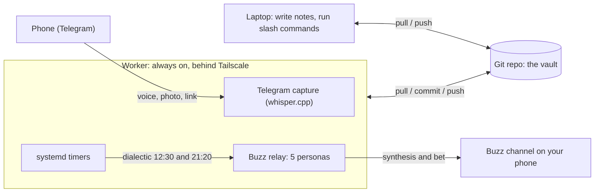
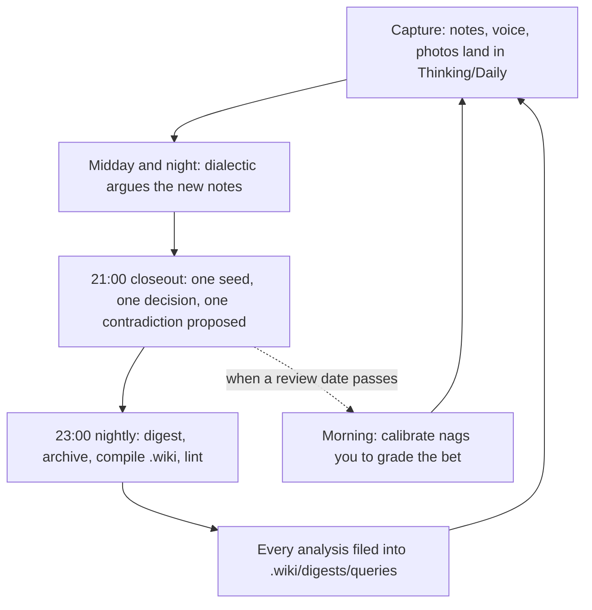

# brainless

**Watson for curious minds. A helper for decision makers.**

Sherlock had the method. Watson wrote it down, asked the obvious question, and kept the
files. This is the Watson. You keep the method.

---

## Where this came from

On the evening of 8 September 2026 I sent myself two voice notes from the car. One said:
the notes I take all day should argue with each other at night. The other said: this
thing should be installable by someone who is not me.

I run a company. Kolay İK, an HR platform out of Istanbul, 2,600 companies, 300,000
employees on it. My days are decisions, most of them made on a phone between two
meetings, and most of them never revisited. I had a vault of notes. I had beliefs
written down. I had decision notes with a "review date" field that nobody ever reviewed.

The notes were a warehouse. What I wanted was a colleague.

So I put five books on a shelf, Browne and Keeley, Annie Duke, Camuffo and Gambardella,
Amy Edmondson, Lafley and Martin, and turned each one into a voice that reads my day and
pushes back. The first round ran on 9 September at 12:30. Five voices, ten replies, one
synthesis, one bet. It found that my argument against a partner's equity ask was aimed
at the wrong object. I would have walked into that meeting wrong.

That is the whole product. Everything else is plumbing.

---

## The goal, step by step

1. **Capture everything, filter later.** Voice notes, photos, links, documents, half
   sentences. They land in `Inbox/` and `Thinking/Daily/` as Markdown. Nothing is
   judged at capture time.
2. **Let the machine read so you do not have to.** A compiler turns every note into a
   summary, clusters summaries into articles, mirrors project status, and writes a daily
   digest into `.wiki/`. You own the notes. The machine owns `.wiki/` and can rebuild it
   from scratch any time.
3. **Write what you believe and what you decided, as bets.** Beliefs live in
   `Thinking/Beliefs/`, each with "what would change my mind". Decisions live in
   `Thinking/Decisions/`, each with a prediction, a confidence and a review date.
4. **Argue before you act.** Five personas test a thesis in two rounds. Round one, each
   applies its own method. Round two, each picks the strongest objection from the
   others and answers it. A moderator writes the synthesis: the best counterargument,
   what would have to be true, a cheap dated test, a probability, and any clash with
   your own beliefs.
5. **Grade yourself.** When a review date passes, the system nags until you write the
   outcome. Ten years of ungraded decisions is one year repeated ten times.
6. **Keep it yours.** Nothing writes into your notes without you. Every command
   proposes; you paste. Private folders never reach the compiled layer. The engine and
   the notes are separate repos.

If you do only step 5, you are ahead of most people I know. Including me, for most of
this year.

---

## Who this is for

People who make decisions for a living and suspect their own reasoning. Founders,
operators, product people, anyone whose calendar is a sequence of judgment calls.

It helps if you already write things down. It helps more if you are willing to be told
you are wrong by a script at 21:20.

## What it is not

- Not a chat app. You talk to it through notes, commands and, optionally, a channel.
- Not a knowledge graph you maintain. The graph is compiled, not curated.
- Not a decision maker. It never picks. Duke would call that resulting in advance.
- Not finished. I built it for one person, then made it installable in a day. Expect
  rough edges, and tell me where they are.

---

## Install

Requirements: git, Python 3.10 or newer, and one LLM backend.

```bash
curl -fsSL https://raw.githubusercontent.com/ezapmar/brainless-public/main/install.sh | bash
```

What happens, in order:

1. Checks git and Python.
2. Clones the engine into `~/brainless`. Pass `--vault <dir>` for another place.
3. Creates `.venv` and installs the one core dependency, the document converter.
4. Checks the LLM backend. Default is the `claude` CLI signed in with a subscription.
   Any OpenAI-compatible endpoint works instead: OpenAI, Together, Grok, Ollama, LM
   Studio. Set `BRAINLESS_LLM_PROVIDER=openai-compatible`, `BRAINLESS_LLM_BASE_URL` and
   `BRAINLESS_LLM_MODEL`.
5. Asks your first name and output language, `en` or `tr`, and writes
   `_Agent-Context/PROFILE.md`.
6. Installs the `brainless` command into `~/.local/bin`.
7. Runs a dry compile as a smoke test.

Safe to re-run. Add `--schedule` to install the hourly conversion, the nightly digest and
the weekly lint: launchd on macOS, systemd user timers on Linux. Add `--yes` to skip the
questions.

To run the script with options instead of piping it:

```bash
git clone https://github.com/ezapmar/brainless-public.git ~/brainless
bash ~/brainless/install.sh --vault ~/brainless --schedule
```

## The first ten minutes

```bash
brainless help                                   # every command
brainless compile --dry-run                      # what would be compiled
brainless compile                                # build .wiki/
brainless search "the thing you keep thinking about"
brainless dialectic "We should hire before we have the revenue"
brainless calibrate                              # decisions due for grading
```

Then open `_Templates/`. Copy `Belief.md` into `Thinking/Beliefs/` and write one thing
you believe about your work. Copy `Decision.md` into `Thinking/Decisions/` for the last
real decision you made, with a prediction and a date. That is enough for the personas
to have something to argue with.

Inside Claude Code or Gemini CLI, from the vault root, the same commands exist as slash
commands: `/decide`, `/contradict`, `/dialectic`, `/ideas`, `/weekly`, `/trace`,
`/connect`, `/graduate`, `/context`. Their definitions live in `.wiki/_commands/` and
work with any agent that can read files.

---

## How it is built

| Folder | Owner | What lives there |
|---|---|---|
| `Work/`, `Personal/`, `Library/` | you | projects, life, reference material |
| `Inbox/` | you | unsorted capture, triaged later |
| `Thinking/` | you | `Daily/`, `Ideas/`, `Beliefs/`, `Decisions/`, calibration |
| `.wiki/` | the machine | compiled layer, regenerable, never hand-edited |
| `_Agent-Context/` | shared | `PROFILE.md`, context, tasks, health, the rules agents follow |
| `_Templates/` | shared | note templates |
| `tools/` | engine | compiler, lint, search, filer, calibration, dialectic |
| `.agents/` | engine | scheduled jobs, systemd units, persona definitions |

A project is any folder under `Work/` or `Personal/` with a `notes.md`.

**The loop.** Capture lands in `Thinking/Daily/`. At 12:30 and 21:20 the dialectic
takes what is new, clusters it into topics and runs the rounds. At 21:00 an evening
close-out proposes one seed idea, one decision worth writing down and one contradiction
with your beliefs. At 23:00 the nightly job writes the digest, archives the raw captures,
compiles and lints. Every analysis is filed back into `.wiki/digests/queries/`, so
tomorrow's question can build on today's answer.

**The LLM never gets tools.** Context is embedded in the prompt. It cannot read, write,
move or delete anything. That is the reason a script can run unattended against a folder
that holds your life.

---

## The five voices

| Persona | Book | What it asks |
|---|---|---|
| Skeptic | Browne and Keeley, *Asking the Right Questions* | What is the conclusion, what are the reasons, which words are ambiguous, what is omitted, what other conclusions are possible |
| Gambler | Annie Duke, *Thinking in Bets* | Write it as a bet. How confident, in a number. Is this outcome or decision quality. Twelve months on, it failed: why |
| Scientist | Camuffo, Gambardella et al., *A scientific approach to entrepreneurial decision-making* | What is the theory, what must be true, what is the cheapest test, what result means terminate and what means pivot |
| Postmortem | Amy Edmondson, *Right Kind of Wrong* | If this fails, is it basic, complex or intelligent failure. Was the homework done. What is the smallest version |
| Strategist | Lafley and Martin, *Playing to Win* | Where to play, how to win, which capabilities, which systems. Passes on topics that are not strategy |

They never mention each other and only answer the moderator and you, so agents cannot
set each other off. Each persona's prompt is a Markdown file in `.agents/buzz/personas/`.
Edit them. Add a sixth. The moderator does not care how many there are.

---

## Addons

None of these are needed for the loop above.

- **Telegram capture.** Voice notes, photos, links and text from your phone become
  `Thinking/Daily/` notes. Transcription runs locally with whisper.cpp.
- **Buzz personas.** The five voices as live agents on a self-hosted
  [Buzz](https://github.com/block/buzz) relay. They answer in a channel twice a day and
  whenever you mention them. This is how I run it; `.agents/buzz/` has the prompts and
  the installer.
- **Google Tasks and Calendar.** Two-way task sync and a brief before each meeting.
- **Meeting transcripts.** An IMAP ingest for meeting report e-mails.
- **An always-on worker.** A second machine that runs the timers, pulls, commits and
  pushes, so your laptop can sleep. The units in `.agents/systemd/` are built for it.

Each needs its own credentials in `~/.config/brainless/`.

---

## Privacy

- The repo you clone contains no notes. Content folders are gitignored in the engine
  repo; your vault is wherever `BRAINLESS_VAULT` points.
- Identity papers, health folders and official documents are ignored anywhere in the
  tree by default. Add your own folder names to `private_segments` in `PROFILE.md` and
  they will never be compiled.
- This public repo is produced from my private vault by `tools/export_public.py`, a
  whitelist copy plus a leak scan that refuses to pass on identity numbers, keys, tokens
  or a name. If you fork this for your own vault, use the same script.

---

## Usage example: a full local setup

This is how the whole thing fits together on real machines. Two shapes are shown: the
one-laptop baseline that everyone starts on, and the two-machine setup we actually run.
Names and values below are placeholders. Nothing here needs a secret checked into the
repo; credentials live outside the vault.

### Shape 1: one laptop (the baseline)

Everything runs on a single machine. The laptop is the author and the scheduler.

```bash
# install the engine and answer two questions (name, language)
curl -fsSL https://raw.githubusercontent.com/ezapmar/brainless-public/main/install.sh | bash

# turn on the hourly compile, the nightly digest and the weekly lint (launchd on macOS)
bash ~/brainless/install.sh --vault ~/brainless --schedule

# from then on, you mostly do this
brainless dialectic "We should hire two seniors before the round closes"
brainless calibrate          # decisions whose review date has passed
```

When the laptop is asleep, nothing runs. That is the only real limit of this shape, and
it is fine for months.

### Shape 2: two machines (author plus always-on worker)

One laptop writes. One small Linux box stays on and does the unattended work: the timers,
the Telegram capture and the Buzz relay. They share a single git repo (the vault).



Both machines run the same LLM backend (a signed-in `claude` CLI, no API key). The one
rule that keeps two writers from fighting: one owner per file, append-only for anything
both machines touch. We learned that the hard way. On 4 September both machines wrote the
same briefing file and every push failed for 51 hours. `_Agent-Context/TRUNK-BASED-DEVELOPMENT.md`
has the full convention.

### The daily loop

Capture goes in, arguments come out, and yesterday's answers feed today's questions.



The worker's timers, as installed by `.agents/systemd/install.sh`:

| When | Command | What it does |
|---|---|---|
| 12:30 and 21:20 | `dialectic` | five personas argue the day's new notes, moderator writes the synthesis and the bet |
| 21:00 | `closeout` | propose one seed idea, one decision worth writing down, one contradiction with your beliefs |
| 23:00 | `nightly` | write the digest, archive the raw capture, compile `.wiki/`, lint |
| Mon 05:00, Fri 21:00 | `dashboard` | rebuild the active-projects view from every `notes.md` |
| Mon 06:30 | `resurface` | bring decisions due for grading back to the top |
| Sun 19:00 | `thinking` | weekly themes, blind spots, promotion candidates |
| Sun 20:00 | `reconcile` | cross-check recent notes against your written beliefs |
| Sun 22:00 | `lint` | fix links and frontmatter across `.wiki/` |

On the laptop the same jobs run through launchd instead, installed by `--schedule`.

### Configuration files

Three things configure a deployment. None of them belong to the engine repo.

**`_Agent-Context/PROFILE.md`** in the vault. Written by the installer, edited by hand.
`owner_name` and `output_lang` shape every prompt; `private_segments` lists folders the
compiler must never touch.

```markdown
---
owner_name: Alex
output_lang: en
company_area: Work
worker_name: worker
owner_full_name: Alex Rivera
private_segments: Health, Family, Legal
---
```

**Environment**, in your shell profile or a systemd `EnvironmentFile` (see `.env.example`):

```bash
export BRAINLESS_VAULT=~/projects/brainless
export BRAINLESS_OWNER_NAME=Alex
export BRAINLESS_OUTPUT_LANG=en
export BRAINLESS_LLM_PROVIDER=claude-cli
# or point at any OpenAI-compatible endpoint instead:
# export BRAINLESS_LLM_PROVIDER=openai-compatible
# export BRAINLESS_LLM_BASE_URL=http://localhost:11434/v1
# export BRAINLESS_LLM_MODEL=llama3.1
```

**Addon credentials**, only if you turn addons on, kept outside the vault in
`~/.config/brainless/`:

```text
~/.config/brainless/
  telegram.env    # bot token and the one chat id allowed to write in
  buzz.env        # relay URL and a token per persona
  google.json     # OAuth client for Tasks and Calendar
  imap.env        # mailbox that receives meeting-report e-mails
```

### A day, concretely

```bash
# morning, over coffee: grade what has come due
$ brainless calibrate
2 decisions past their review date. Write the outcome for each:
  - 2026-06-14  "Ship the pricing change without a beta"   predicted: +8% conversion

# a thesis you want tested before a meeting
$ brainless dialectic "Move the team to a four-day week for one quarter"
Skeptic     : the conclusion hides two claims, output and morale, measured differently
Scientist   : cheapest test is one team for six weeks, terminate if throughput falls >10%
Gambler     : write it as a bet. 60% it holds. In twelve months it failed because ...
Moderator   : strongest objection is measurement. What must be true: a throughput metric
              you trust weekly. Cheap dated test: one team, six weeks, review 2026-11-01.
              Clashes with belief "async beats synchronous for deep work".

# it is filed for you; tomorrow's question can build on it
$ ls .wiki/digests/queries/ | tail -1
2026-09-09-dialectic-four-day-week.md
```

Overnight the worker runs the timers above, so by the time you open the laptop the
digest is written, the projects view is current, and any decision due for grading is
waiting at the top. You do not need any of this to start. One laptop is the baseline.
The worker is where you go when the laptop being closed starts to cost you.

---

## Honest limits

- The default path assumes a Claude subscription. The OpenAI-compatible path works but
  I have tested it less.
- Turkish and English are the two output languages. Others will need prompt edits.
- The five personas are my shelf. Yours may be different, and should be.
- I am not a decision scientist. I am an operator who got tired of being wrong in the
  same way twice.

## Contributing

Issues and pull requests are open. If a persona gave you a bad argument, paste the
thread. If the installer broke on your machine, paste the output. Both are more useful
than a feature request.

## License

MIT. See `LICENSE`.

---

Capture everything. Argue at night. Grade yourself in the morning.
