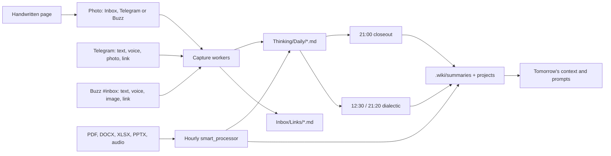

# The capture flow

brainless starts with a wide front door. A thought does not need to arrive as a
finished note. It can be a handwritten page, a photograph, a voice memo, a link,
a sentence in Telegram or Buzz, or a document dropped into the vault. The first
job is to keep it. Sorting and connection happen later.

## The front door

- **Handwritten notes.** Drop a JPG, PNG, HEIC or similar image at the top of
  `Inbox/`, or send the image to Telegram or Buzz. Claude reads the handwriting,
  preserves uncertain words as uncertain, corrects obvious names from
  `_Agent-Context/CONTEXT.md`, adds wikilinks and turns visible actions into task
  lines. Inbox images are archived under `_attachments/handwritten/`; the capture
  note stays in `Thinking/Daily/` and embeds the original.
- **Voice.** Send a Telegram voice note, audio file, video note or video, or attach
  audio in Buzz `#inbox`. `whisper.cpp` transcribes it locally. The LLM then cleans
  punctuation and obvious transcription errors without changing the thought.
- **Text.** Send a short thought in Telegram or Buzz. The LLM gives it a title,
  adds useful wikilinks and tags, and writes the result as a normal daily capture.
- **Links.** Send a URL with an optional comment. The fetcher checks that the host is
  public, extracts readable page text, and writes a reading note to `Inbox/Links/`.
- **Documents.** Put PDFs, Word files, spreadsheets, presentations or supported
  audio in `Work/`, `Personal/` or `Library/`. MarkItDown creates a raw Markdown
  conversion beside the original. High-value resources also get a Summary and a
  Fiche de Lecture. Originals and raw conversions remain recoverable.
- **Direct notes.** Type or hand-edit durable beliefs, decisions and project notes
  in their human-owned homes. These are the source of truth; automation proposes
  and connects, but does not silently decide for you.

## Obsidian is the surface

Obsidian is where the human reads, writes and navigates the vault. The common format
is Markdown, so a handwritten OCR result, a Telegram transcript, a Buzz capture, a
direct note and a converted document can all be opened, linked and searched in the
same place. The core **Graph view** shows the explicit `[[wikilinks]]` between notes;
the **Smart Connections** plugin adds a related-content view when a useful link has
not been written yet. Dataview and the generated `INDEX.md`, MOCs and project
mirrors provide more structured entry points without replacing the source notes.

The graph is not a separate database to maintain. It grows as capture workers and
LLM prompts add links, while the regular compiler and linter refresh summaries,
backlinks, frontmatter and unresolved-link reports. Open the human homes for truth;
use the graph, Smart Connections and `.wiki/` surfaces to find the next connection.

## What the LLM does

The LLM is connective tissue, not the owner of the archive. It can clean a
transcript, read a note image, extract a page, correct a proper noun using the
current context, and add `[[wikilinks]]` between a capture and an existing project,
belief or person. It does not get general file tools for text processing. A photo
reader gets only the image-reading capability it needs. Every capture keeps a
source footer, and failed or empty output is left for retry rather than replacing
the source.

## The automated jobs

| When | Job | Connection |
|---|---|---|
| On Inbox image change | `inbox_watch_wrapper.sh` | OCRs a handwritten or printed image immediately; `smart_processor.py --images` is also the hourly backstop. |
| Every 2 minutes on the worker | `telegram_worker.sh` | Polls Telegram, transcribes voice locally, reads photos, fetches links, and writes `Thinking/Daily/` or `Inbox/Links/`. |
| Every 2 minutes on the worker | `buzz_capture_worker.sh` | Reads owner posts in Buzz `#inbox`, handles text, voice, images and links, and writes the same capture homes. |
| Hourly | `cron_wrapper.sh` -> `smart_processor.py` | Converts documents, OCRs missed Inbox images, validates outputs, and records retry state. |
| 12:30 and 21:20 | `tools/dialectic.py` | Clusters that day's Telegram and Buzz captures, asks six critical personas to argue them in `#dialectic`, and files the synthesis. |
| 21:00 | `tools/evening_closeout.py` | Reads the day's captures and proposes one seed, one decision and one contradiction. |
| 23:00 | `tools/nightly_processor.py` | Turns daily captures into a digest, extracts owner tasks, archives raw files, compiles `.wiki/`, and refreshes lint. |
| Weekly | `resurface`, `thinking`, `reconcile`, `lint` | Brings due decisions back, asks a reflective question, checks belief drift and repairs the compiled layer. |

## The connection loop

The important boundary is `Thinking/Daily/`. Telegram and Buzz captures, Inbox
image OCR, and other short-lived thoughts arrive there as Markdown. The closeout
and dialectic read those files while they are fresh. The nightly job then archives
the raw captures and writes durable derivatives into `.wiki/` and the task ledger.
The next day's context, dashboard, Today queue and review prompts read those
derivatives and link back to the human notes.

Nothing needs to be classified at the moment of capture. The system can connect a
voice memo to a decision later, surface a handwritten task in the daily digest, or
bring an old belief back when new evidence arrives. The human note remains the
place where a belief, decision or action becomes real.

## Ownership and recovery

Capture workers own new files in `Thinking/Daily/` and `Inbox/Links/`. The human
owns `Work/`, `Personal/`, `Thinking/Beliefs/`, `Thinking/Decisions/` and project
notes. The compiler owns `.wiki/`. Worker commits are path-scoped and serialised;
raw images, source documents and failed conversions are retained. If a model call,
network request or scheduled job fails, the source stays in place and the retry
state records what happened.

## Conversation boundary

Telegram only receives captures. All receipts and processing errors appear in
Buzz #inbox. Daily actions, thinking questions and approvals happen in Buzz
threads. See [Buzz interactions](buzz-interactions.md) for the channel map and
delivery recovery.
