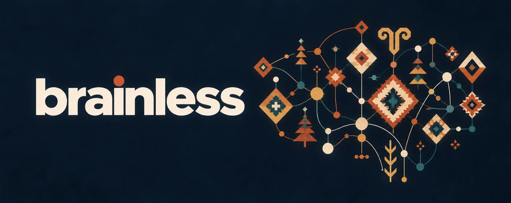

<p align="center">
  
</p>

# Design

brainless has no interface yet. It has a command line, a README, a wiki and a few chat avatars. This page is the design point of view for all of them, and for any interface that comes later.

## The idea

A brain drawn as a kilim. Anatolian weaving motifs (the diamond eye, the tree of life, the ram's horn, the star) sit on the nodes of a network, joined by thin lines. Notes are the motifs; links are the threads. The mind is something woven, knot by knot, and it only holds because each knot is tied to others.

What follows from that:

- **Flat and geometric.** Solid fills, hard edges, stepped diamonds. No gradients, no glow, no drop shadows.
- **Warm on dark.** The home ground is a deep night blue. Colour comes from madder, saffron and cream, as in a dyed rug. Teal is the only cool colour and is used sparingly.
- **Symmetry with a centre.** Layouts balance around one strong centre, the way the mark does. One focal element per screen.
- **Lowercase.** The name is always `brainless`, lowercase, in text and in the wordmark.

## Palette

| Token | Hex | Role |
|---|---|---|
| night | `#0A1825` | Ground. Banner, icon and dark interface background |
| ink | `#042538` | Deep outline inside motifs; text on cream |
| cream | `#FBDEA5` | Nodes; light surfaces |
| bone | `#F9EBDB` | Wordmark and body text on night |
| madder | `#CB221F` | Deep red; errors |
| vermilion | `#F24B1E` | Brand accent: the dot over the i, headings, primary action |
| orange | `#F97327` | Secondary warm |
| saffron | `#FBA335` | Warnings; highlights |
| marigold | `#FBB94B` | Light warm fill |
| teal | `#0C9794` | Success, links, the one cool note |
| sage | `#9BB38D` | Muted secondary; disabled |

The code copy is `tools/brand.py` (`PALETTE`). Change both together.

Proportions follow the mark: roughly half warm reds and oranges, a quarter cream, the rest ink and teal. On a page that means a night or cream ground, one vermilion accent, and teal only where something is actionable or healthy.

Contrast: bone, cream, marigold and saffron read well on night. On a light ground use ink for text and vermilion or teal for accents; never put cream, marigold or saffron text on white.

## Logo

| File | Use |
|---|---|
| `assets/brainless-logo.svg` | The mark, transparent. Default everywhere a logo fits |
| `assets/brainless-logo.png` (1024), `-512`, `-256`, `-64` | Raster mark, transparent |
| `assets/brainless-logo.webp` | Web raster, transparent |
| `assets/brainless-icon.svg`, `.png` (1024 square) | Mark on night. Avatars: GitHub, Telegram, Buzz |
| `assets/favicon.ico` | 16, 32, 48, 256 |
| `assets/brainless-banner.png`, `.webp` | Wordmark plus mark on night. README and wiki headers |
| `assets/brainless-social.png` (1280x640) | GitHub social preview. The banner padded to 2:1 with its own ground, never cropped |

Rules:

- The mark is traced from the supplied artwork (28/09/2026). Reuse these files; do not redraw or recolour them.
- Leave clear space around the mark of at least the width of one of its outer diamonds.
- Minimum size: 64 px for the mark, 16 px for the icon (the favicon).
- On light grounds use the transparent mark; on dark grounds use it as is or the icon.
- Wordmark: a heavy geometric sans, lowercase, bone on night, with a vermilion dot for the tittle of the i. Until a typeface is chosen, the banner is the only wordmark; do not typeset one.

## Where the logo is set

Three places take the icon outside this repo, and none of them reads it from here, so each is set once by hand or by an installer.

- **GitHub social preview.** Repository Settings, Social preview, upload `brainless-social.png`. There is no API for it; `openGraphImageUrl` in the GraphQL API shows what is live.
- **Telegram bot.** The Bot API `setMyProfilePhoto` method takes a static JPG. Render `brainless-icon.svg` at 640 px and upload it as `{"type":"static","photo":"attach://p"}`.
- **Buzz agents.** The installers in `.agents/buzz/` pass `--avatar` with `--name`, pointing at `brainless-icon.png` on GitHub; set `BUZZ_AVATAR_URL` to use another address. A Buzz profile update replaces the whole profile, so any manual `buzz users set-profile` must pass the name and about text again, or they are wiped.

## Command line

The terminal is the interface for now, so it follows the same rules with fewer colours.

- Colour is 24-bit ANSI from `tools/brand.py`, via `paint(text, token)`.
- Colour only on a real terminal. `NO_COLOR`, `TERM=dumb` and pipes get plain text. Output must read the same without colour.
- Colour carries meaning, not decoration: vermilion for the name and step headers, teal for ok, saffron for warnings, madder for errors. Everything else stays in the terminal's own foreground colour.
- No background colours, no boxes, no emoji. Terminals may be light or dark, so no cream, marigold or bone text.

## A future interface

If brainless grows a web or desktop interface, start from these CSS variables and keep the rules above.

```css
:root {
  --bl-night: #0A1825;  --bl-ink: #042538;
  --bl-cream: #FBDEA5;  --bl-bone: #F9EBDB;
  --bl-madder: #CB221F; --bl-vermilion: #F24B1E; --bl-orange: #F97327;
  --bl-saffron: #FBA335; --bl-marigold: #FBB94B;
  --bl-teal: #0C9794;   --bl-sage: #9BB38D;
}
```

Dark theme: night ground, bone text, vermilion accent. Light theme: bone ground, ink text, vermilion accent. Graph views draw notes as nodes and links as thin lines, in the mark's own style: round nodes, a stepped diamond for the focused note.
