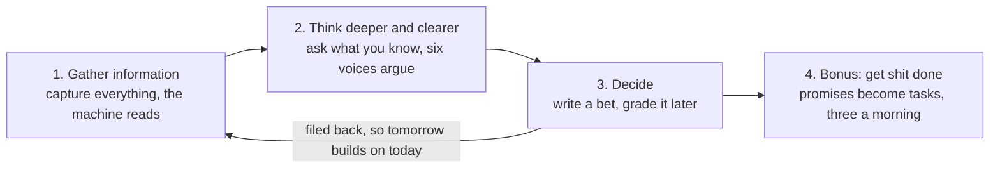
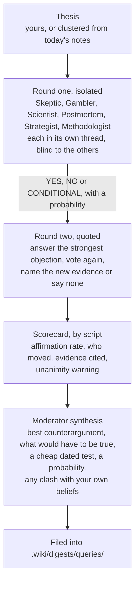

# How brainless works

The short version is in the [README](../README.md). This page is the long one: the
loop with its mechanics and file names, the privacy rules, the addons and the exact
setup I run.

## The loop

Four lines, with the mechanics and the file names. brainless is one loop, and each part
is there because the one before it is useless alone. Notes that nobody reads are a
warehouse. Summaries that nobody argues with are a tidier warehouse. And an argument that
nobody grades is entertainment, which Galatasaray already provides.

### Three layers, and the failure they guard against

The bet underneath all four lines is connectivity. A note on its own is storage. Notes
wired to each other are a map, and the value shows up when you move across it: an
argument from a meeting in May lands beside a belief written in March and the two change
each other.

Connectivity alone fails in a predictable way. A system that touches every subject and
holds none of them is very good at sounding informed and no use at all when something
has to be decided. So the loop is read as three layers, each one worth its cost only if
it feeds the next.

1. **Collect.** Everything comes in through one door and the machine reads it. Line 1
   below.
2. **Think clearly.** The point is not a tidier disk, it is what you can hold in your own
   head afterwards, which is why the vault argues instead of agreeing. Line 2.
3. **Decide.** A small number of dated calls, each carrying a prediction and a review
   date. Line 3.

Line 4 is the bonus: the promises that fall out of all three, kept where they cannot be
lost.

### 1. Gather information

#### Capture everything, filter later

Handwritten pages, voice notes, photos, links, documents, half sentences, Telegram
messages and Buzz `#inbox` posts all come in through the same wide front door. They land
in `Inbox/`, `Inbox/Links/` and `Thinking/Daily/` as Markdown, and nothing is judged on
the way in. Judging a thought at capture time is how good ones die in a car park. The
[capture flow guide](capture-flow.md) maps every entrance and every scheduled job.

Two doors are slower than the rest, so they queue.

- **YouTube and podcast links:** a shared YouTube or Apple Podcasts episode link comes back
  a few minutes later as a transcript in `Inbox/Media/`. It carries a `[mm:ss]` marker
  every three minutes and speaker turns, and it is transcribed on the machine when there
  are no captions (`tools/media_import.py`).
- **Chat history:** a Claude or ChatGPT export is triaged first, imported without the
  throwaway and personal conversations, and only the few worth compiling are promoted
  (`tools/chat_import.py`).

#### Let the machine read so you do not have to

A pile of captures is only useful if somebody reads it, and I was never going to be that
somebody. So a compiler turns every note into a summary, folds summaries into concept
pages that update in place, mirrors project status and writes a daily digest into `.wiki/`. Documents keep
their originals and their raw Markdown conversions. The high-value ones also get a
Summary and a Fiche de Lecture, and a missing or empty output is retried instead of
quietly accepted.

Obsidian is the surface, not the substrate. **Every input becomes Markdown** before
anything else touches it: documents through markitdown called as a library, audio
through whisper on the machine, photographs read into text. A converted source keeps
two files, the mechanical `_raw.md` conversion and an authored note beside it, so a
later reader can always tell evidence from thinking. That choice is what makes grep and
BM25 enough instead of an index server (a local embedding index, rebuilt from the
Markdown, adds meaning when words fail), makes every change a git diff, and means the
vault outlives every tool in this repository. Graph view follows the explicit
`[[wikilinks]]`, and Smart Connections shows related notes that do not have a written
edge yet. You own the notes. The machine owns `.wiki/`, which means nobody has to spend a
Sunday curating a knowledge graph.

#### Pages that remember

A summary says what one source said. A **concept page** says what the vault knows about
one idea, and every new source updates it instead of piling up beside it.

- **Disagreements are kept.** When a new source disagrees, both positions stay on the page
  with their sources and dates, plus what would settle it. A claim that went out of date
  is struck through with the reason, never deleted.
- **Claims carry confidence.** Every claim is labelled primary, secondary, self-reported or
  unverified.
- **A validator guards every rewrite.** The model rewrites the whole page each time, so a
  deterministic check refuses any version that drops a struck claim or a cited source.
- **New concepts wait for a yes.** The compiler proposes them, and I say yes or no in
  `_Agent-Context/concepts.md`.

The same compile does the dull, useful work around those pages:

- **The linker** turns the first mention of a known person, company or concept into a
  link, without a model.
- **The index** gives every page one line, so an agent reads it before opening anything.
- **Aliases** catch the words I actually use, and search folds Turkish letters, so "maas"
  finds "maaş".
- **Duplicates** are proposed for a merge, never merged.
- **Model chatter** ("Write is disabled, so I'll output…") is refused before it becomes a
  page.

Two numbers keep this honest. The graph gets measured every week: the share of pages
nothing links to, links per page, how much of the vault hangs together, and which pages
bridge two clusters. And thirty-four questions with known answers are asked every night.
When the share of right answers in the top five drops, the health report says so before a
bad answer does. For a picture, `brainless graph` writes the whole graph as a file Gephi
opens, coloured by page type.

The method underneath is **Zettelkasten**: one concept per note, a permanent `zk:`
address that survives every rename, links rather than folders as the structure, and an
archive that tells you which note it wants next. `/backlog` is that last part made
mechanical, counting unresolved links and handing back a ranked queue of notes the vault
is asking for. The passes a note goes through afterwards, and why judging is postponed
at each one, are written up in [the method](method.md). The books, papers and tools
behind the method, the voices and the engine are listed in
[References](references.md).

### 2. Think deeper and clearer

#### Argue before you act

Six personas test a thesis in two rounds. In round one each persona gets its own
thread, applies its own method without seeing the others, and votes YES, NO or
CONDITIONAL with a probability. In round two each reads the rest, picks the strongest
objection, answers it, votes again and names the new evidence that moved it, or says
"none".

A script scores the round before the moderator writes a word, so the synthesis starts
from counted votes and not from a mood. A rolling 30 day scorecard raises a flag when
affirmation climbs above 60 per cent, or when a persona never votes NO. Six voices that
always agree with you are a fan club, and I did not need software for that.

The voices come from the shelf.

| Persona | Book | What it asks |
|---|---|---|
| Skeptic | Browne and Keeley, *Asking the Right Questions* | What is the conclusion, what are the reasons, which words are ambiguous, what is omitted, what other conclusions are possible |
| Gambler | Annie Duke, *Thinking in Bets* | Write it as a bet. How confident, in a number. Is this outcome or decision quality. Twelve months on, it failed: why |
| Scientist | Camuffo, Gambardella et al., *A scientific approach to entrepreneurial decision-making* | What is the theory, what must be true, what is the cheapest test, what result means terminate and what means pivot |
| Postmortem | Amy Edmondson, *Right Kind of Wrong* | If this fails, is it basic, complex or intelligent failure. Was the homework done. What is the smallest version |
| Strategist | Lafley and Martin, *Playing to Win* | Where to play, how to win, which capabilities, which systems. Passes on topics that are not strategy |
| Methodologist | Quivy and Van Campenhoudt, *Manuel de recherche en sciences sociales* | Rewrites the thesis as a research question, names the hidden angle, builds concept, dimension and indicator, writes the falsifiable hypothesis and the cheapest observation plan |

They never mention each other and only answer the moderator and you, so agents cannot
set each other off. It is the best-behaved meeting in my week. Each persona's prompt is
a Markdown file in `.agents/buzz/personas/`. Edit them. Add a seventh. The moderator does
not care how many there are.

#### Research, but only when the week earns it

The loop above runs on what you already know. Sometimes a topic turns up that the vault
cannot answer, and the tempting move is to point agents at the internet and read the
essay they come back with. That produces something plausible every time, which is the
problem with it.

So research here follows a social science method, taken from Quivy and Van Campenhoudt,
*Manuel de recherche en sciences sociales*, and adapted for a vault and a set of agents.
The parts the code enforces:

- **The opening question is written first**, in one sentence, before any source is
  opened. Every term defined, answerable with the access you actually have, and a real
  question rather than one whose answer is implied by how it is asked.
- **The lens is named before the hypotheses**, in one sentence: which angle the research
  looks through and what it is trying to explain. Without it a set of hypotheses
  scatters across three unrelated questions, each defensible, none adding up.
- **Hypotheses are falsifiable**, in the same shape as a decision's prediction and
  confidence, which is what lets a research pass be graded later instead of admired.
- **Reading happens in salvos**, at most five sources each, every one on a different
  angle, with interpretation in between. Unlimited fan-out is the modern form of the
  trap the book calls insatiable reading.
- **Every finding carries `Kaynak: <URL>` and one of `verified`, `claim`, `unknown`.**
  Unlabelled lines are deleted mechanically before synthesis, `unknown` lines may not be
  used as support, and when there is no evidence the report says so, because absence of
  evidence is not evidence.
- **The analysis interprets the deviations** between what was expected and what was
  found. A report that only confirms was not testing anything.

Two guards keep it rare. A pass runs only if the week produced an **epic**, so a week of
ordinary work costs nothing and the job exits in seconds. And a topic already researched
within eight weeks is not researched again: the recurrence is reported instead, because
a question that keeps coming back without closing is waiting for a decision, not for
more evidence.

The full adaptation, the three acts and the seven steps each mapped to a file, is in
[the method](method.md).

#### Where the clarity comes from

Nothing above makes you smarter. It changes what you have to write down before you may
move on, and the order you see things in. Criteria before options, so a favourite
cannot write its own test. A base rate before a confidence, so the number is a number.
Five readings taken blind, so the first voice does not set the room. One dated action
at the end, so a decision cannot pass as an opinion. A red line when all five agree.
Each mechanism, with the file it lives in, is in
[docs/thinking-clearer.md](thinking-clearer.md); every command, with what it asks
and what it guards against, is in [docs/commands.md](commands.md).

---

### 3. Decide

#### Write what you believe and what you decided, as bets

Reading is still not thinking. The compiled layer can tell you what you wrote, but it
cannot tell you what you hold to be true, so that part is typed by hand. Beliefs live in
`Thinking/Beliefs/`, each with a line for "what would change my mind". Decisions live in
`Thinking/Decisions/`, each with a prediction, a confidence and a review date.

The format matters more than it looks. A bet can lose, and something that can lose can
be argued with.

#### Grade yourself

An argument ends in a bet, and a bet is worth nothing until somebody settles it. When a
review date passes, the system nags until you write the outcome. `brainless calibrate`
lists what is due, and the [Today queue](today-queue.md) keeps the daily ask small.
`brainless today` offers at most three items: a decision, a commitment and one piece of
evidence to review, each with a link to its source. Answers are previews until you apply
them. You can defer an item to a date or dismiss it with a reason, and the existing
morning worker sends the queue to Buzz #tasks, so there is no new timer to install.

Ten years of ungraded decisions is one year repeated ten times. If you do only this
step, you are ahead of most people I know. Including me, for most of this year.

Every analysis, graded or not, is filed back into `.wiki/digests/queries/`. That is
where the loop closes, because tomorrow's question gets to build on today's answer.

### 4. Bonus: get shit done

Decisions come with promises attached, and promises are the first thing to fall out of a
busy head.

- **Promises become tasks.** Commitments from meeting reports and the day's captures are
  appended to the task ledger in `_Agent-Context/TASKS.md`, with a near-duplicate check so
  a promise rephrased on a later day does not become a second task. An optional sync keeps
  the ledger and Google Tasks in step both ways.
- **At most three things a morning.** `brainless today` offers a decision due for
  grading, the oldest open commitment and one piece of evidence to review, each with a
  link to its source. Empty categories stay empty, and finishing an item does not refill
  its slot. See the [Today queue](today-queue.md).
- **Answer in a thread.** The queue, reminders and the weekly question arrive in Buzz.
  Answers are previews until you apply them: "apply" writes the note, "defer to Friday"
  moves it, "dismiss" drops it with a reason. See [Buzz interactions](buzz-interactions.md).

---

## Keep it yours

All of it runs on your own hardware: the scripts, the schedulers, the vault, the search
index. The only thing that ever leaves the machine is a prompt to whichever model you
configured, and pointing it at Ollama or LM Studio keeps even that at home.

You do not have to choose once, for everything. Each call site names a **lane**, and a
lane can be routed to its own model: the short private ones, like deciding how large
the work in a note is, on a model running on your own box through the `goose` provider,
while the long prose stays with a large model. The reverse is also useful, a cloud lane
falling back to the local model when a subscription expires or the network is down. The
fallback only goes that way: a lane pinned local was pinned for privacy, and a timeout
is not consent to send the same text somewhere else. `python3 tools/llm.py --lanes`
shows where each one currently goes, and [docs/local-inference.md](local-inference.md)
covers what a small model can and cannot do, with measurements from a laptop-class
worker rather than promises.

A loop that runs unattended against a folder holding your life needs one rule above all
the others, which is that nothing writes into your notes without you. The machine
proposes and you apply. Private folders never reach the compiled layer. The engine and
the notes are separate repos, so you can share one and keep the other.

The rule is enforced by who owns which folder.

| Folder | Owner | What lives there |
|---|---|---|
| `Work/`, `Personal/`, `Library/` | you | projects, life, reference material |
| `Inbox/` | you | unsorted capture, triaged later |
| `Thinking/` | you | `Daily/`, `Ideas/`, `Beliefs/`, `Decisions/`, calibration |
| `.wiki/` | the machine | compiled layer, regenerable, never hand-edited |
| `_Agent-Context/` | shared | `PROFILE.md`, context, tasks, health, the rules agents follow |
| `_Templates/` | shared | note templates |
| `tools/` | engine | compiler, lint, search, filer, calibration, dialectic |
| `.agents/` | engine | scheduled jobs, systemd units, persona definitions |

Every script in `tools/` and `.agents/scripts/` is described in the
[scripts reference](scripts.md): what it is, what it does, and why it is built the
way it is.

A project is any folder under `Work/` or `Personal/` with a `notes.md`. Project mirrors
track changes across all permitted source files and exclude private descendants. Use
`## Next Action` in a project note for its next concrete step. `## Kill Criteria` stays
separate on the dashboard, because the condition under which you would stop is a
different thing from a task.

**The text-processing LLM never gets general file tools.** Context is embedded in the
prompt. It cannot read, write, move or delete anything. Image OCR is the narrow
exception, and even there the image reader receives only the specific image it needs.
That is the reason a script can run unattended against a folder that holds your life.

Inside that fence the LLM is the connective tissue of the loop. Local whisper.cpp
transcribes voice. Claude reads handwritten images and cleans the text, fixes names
against the current context, and adds links between a capture and the notes it touches.
The original image, source document or raw conversion stays recoverable, and a failed
model call does not erase the input.

Privacy follows from the same separation.

- The repo you clone contains no notes. Content folders are gitignored in the engine
  repo; your vault is wherever `BRAINLESS_VAULT` points.
- Identity papers, health folders and official documents are ignored anywhere in the
  tree by default. Add your own folder names to `private_segments` in `PROFILE.md` and
  they will never be compiled.
- This public repo is produced from my private vault by `tools/export_public.py`, a
  whitelist copy plus a leak scan that refuses to pass on identity numbers, keys, tokens
  or a name. If you fork this for your own vault, use the same script.

The rules are checks, not requests.

- **Lessons:** your standing preferences and the lessons from correcting an agent live in
  `_Agent-Context/LEARNINGS.md`, each with the rule, why, and how to apply it. They sit in
  the vault, not in one tool's memory. The session hook loads the file, and the Buzz agents
  and the reply worker read it, so a correction given once reaches every agent.
- **Hooks:** Claude Code hooks in `.claude/settings.json` run on every tool call.
  - A write into a human folder asks first, and so does a deletion.
  - A secret, a bank number or a misplaced briefing is refused.
  - A wiki page without its language and English summary goes straight back.
  - The session starts with the context files and `LEARNINGS.md` already loaded.
- **Run log:** every scheduled run leaves one line with what it actually did. A job that
  fails, goes quiet, or runs every night with nothing to do shows up in the health
  report the next morning.
- **Backups:** sync is not backup, so once a month the whole vault, history included, is
  sealed with `age` to a key the machine cannot open and put in a folder that sync does
  not reach. A restore test proves it comes back, and the health report counts the days
  since both.

---
## Addons

The loop above runs on one laptop with none of these. Each one removes a specific
friction, and each needs its own credentials in `~/.config/brainless/`.

- **Telegram capture.** Voice notes, photos, links and text from your phone become
  `Thinking/Daily/` notes. Transcription runs locally with whisper.cpp. It is an inbox
  only: nothing is sent back over Telegram.
- **Buzz conversation.** Everything the system says to you goes through Buzz channels:
  capture receipts in `#inbox`, the Today queue in `#tasks`, the weekly question in
  `#thinking`, alerts in `#ops`. You reply in the thread; `apply` on the latest preview
  is the only way an automated path writes a human note. Messages wait in a local outbox
  until the relay acknowledges them. See [Buzz interactions](buzz-interactions.md).
- **Writing and narrative agents.** Two more channels, `#writing` and `#narratives`,
  each with a live agent that drafts long-form pieces or children's stories in
  conversation with you. It reads the whole vault, writes only to its drafts folder, runs
  your editing lint before every draft and reports the counts. A weekly writing map and a
  pitch round every second month feed it. See [Writing agents](writing-agent.md).
- **Buzz personas.** The six voices as live agents on a self-hosted
  [Buzz](https://github.com/block/buzz) relay. They answer in a channel twice a day and
  whenever you mention them. This is how I run it; `.agents/buzz/` has the prompts and
  the installer.
- **Google Tasks and Calendar.** Two-way task sync and a brief before each meeting.
- **Meeting transcripts.** An IMAP ingest for meeting report e-mails.
- **CRM snapshot.** A read-only pull from your CRM (Pipedrive first; the provider
  seam in `.agents/scripts/crm_capture.py` takes others) into a status block the
  briefing copies and an event log per company under `Inbox/CRM/`. Organisation
  and deal level only, no people, no LLM. Drop your token in
  `~/.config/brainless/pipedrive_api_token`; without it the script is a no-op.
  Setup, flags, example output and the provider seam:
  [docs/addons/crm-pipedrive.md](addons/crm-pipedrive.md).
- **An always-on worker.** A second machine that runs the timers, pulls, commits and
  pushes, so your laptop can sleep. The units in `.agents/systemd/` are built for it, and
  every network job waits for the connection first, so a worker that sleeps and wakes
  never spams failures for the seconds it takes the network to come back.

---

## Usage example: our real setup

I run this on three devices: an **iPhone 16 Pro** for capture (Telegram in) and
conversation (Buzz out), a **MacBook Pro** where I write and run the slash commands,
and an always-on **laptop running [Omarchy](https://omarchy.org) (Arch Linux)** behind
Tailscale that runs the timers, the capture, the Buzz relay and the persona agents, so
the Mac can sleep. The devices, the diagram, the full schedule and the real configuration
(units, sandbox, placeholder secrets) are in [Reference deployment](reference-deployment.md).

---

## Where it is going now

For a year the system was a pipeline. Notes went in, a compiler read them, timers posted
the results and I read them on the phone. It talked. I did not talk back. The morning
queue arrived as a message with buttons on it, and the buttons were the whole
conversation.

That changed on 21 September 2026. Telegram now only listens. Every answer the system
gives me, every question it asks and every approval it needs lives in a Buzz channel, in
a thread, next to the message it belongs to. I reply in the thread the way I would reply
to a colleague. "Apply" under a preview writes the note. "Defer to Friday" moves it.
Anything else gets an answer with the vault paths it stands on.

Two channels went further. In `#writing` an agent drafts long-form pieces with me, one
thread per piece, and runs my own editing lint before it shows me anything. In
`#narratives` another one writes children's stories, chapter by chapter, with an
illustration note at the end of each. Both read the whole vault and can write to exactly
one folder. Moving a draft out of that folder is my job.

So the work now is workflows and conversation. The pipeline stays. What I am building on
top of it is the set of bounded exchanges a person and a system can have without either
of them making a mess. A question with a revision-bound approval. A draft with a lint
report. A pitch with its sources. Each one is small on purpose. I do not know yet which
of them will survive a month of daily use, and I would rather find that out in threads
than in a roadmap. See [Buzz interactions](buzz-interactions.md) and
[Writing agents](writing-agent.md) for how each exchange is bounded.

## Honest limits

- The default path assumes a Claude subscription. The OpenAI-compatible path works but
  I have tested it less, and one piece does not cross over: reading handwriting and
  whiteboard photos uses the Claude CLI's own file-reading tool, so on another backend
  image capture is the part that will not work yet. Text, voice and documents are fine.
- `output_lang` in `PROFILE.md` sets the language of every LLM output. Fixed labels and
  Buzz replies ship in English and Turkish (`tools/locale/`); another language is a new
  locale directory.
- The six personas are my shelf. Yours may be different, and should be.
- I am not a decision scientist. I am an operator who got tired of being wrong in the
  same way twice.

