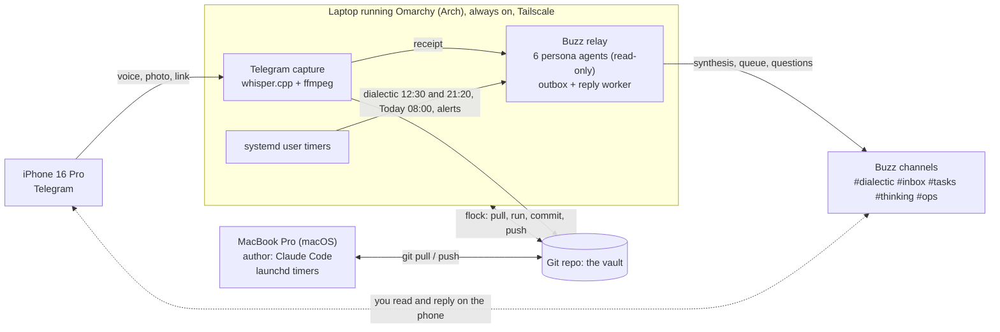

# Reference deployment

> **Run it:** the real three-device setup, as a recipe to grow into.

You do not need three devices to start. One laptop is the baseline: the whole loop in
[How it works](how-it-works.md) runs on it with none of the addons. This page is the
exact deployment I run, on three devices, as a recipe to grow into. Nothing here is
invented. The only edits are to secret values. Tokens, keys, relay URLs and the Tailscale
address are shown as placeholders, because they must never be committed. Everything else
(the units, the paths, the schedule) is what actually runs.

## The three devices

- **iPhone 16 Pro.** Capture and conversation. A Telegram bot receives voice notes, photos,
  links and text through the day. Voice is transcribed locally, images are read by Claude
  vision, and each one lands as a Markdown note in `Thinking/Daily/`. Everything coming
  back (receipts, the Today queue, the weekly question, alerts) is a Buzz channel on the
  same phone, and replies go in the thread. Telegram never answers.
- **MacBook Pro (macOS).** The author. I write notes and run the slash commands here. Claude
  Code signed in with a subscription, no API key. launchd runs the hourly compile, the
  nightly digest and the weekly lint. This machine pushes when I close it for the night.
- **A laptop running [Omarchy](https://omarchy.org) (Arch Linux).** The always-on worker.
  It stays on behind Tailscale and does everything unattended: the systemd timers, the
  Telegram capture with whisper.cpp, the Buzz relay that hosts the six personas as live
  agents, the two-minute reply worker that reads my answers in Buzz threads, and the
  Writer and Narrator agents in `#writing` and `#narratives`
  ([Writing agents](writing-agent.md)). It pulls, runs, commits
  and pushes so the Mac can sleep.



Both machines run the same `claude` CLI, no API key. One rule keeps two writers from
fighting: one owner per file, append-only for anything both touch. We learned it the hard
way. On 4 September both machines wrote the same briefing file and every push failed for
51 hours. Two computers, one file and no adults in the room. Git operations on the worker
are now serialised with `flock` against a 30 minute backup timer. Every job ends in the
same backup step; when the run log is the only change, it waits for the next half hour
instead of making a commit of its own (a two-minute poller once made 330 a day), and
`_Agent-Context/TRUNK-BASED-DEVELOPMENT.md` has the full convention.

## The loop, on the clock

The same loop, with times attached. These are the worker's timers, installed
verbatim by `.agents/systemd/install.sh`:

| When | Runs | What it does |
|---|---|---|
| 12:30 and 21:20 | `tools/dialectic.py` | six personas argue the day's new notes (isolated round one, quoted round two), moderator posts the scorecard and synthesis to `#dialectic` and files them; on a silent day the evening run argues one vault topic instead |
| 02:00 | `tools/dialectic.py --run night` | the local-model experiment: the six personas answer through the worker's own model, one at a time, while the moderator and a judge lane stay on the cloud and grade each reply; a replay of the day's first topic, scored nowhere, with a five-night kill rule (see [local inference](local-inference.md#the-night-window-experiment)) |
| 21:00 | `closeout` | propose one seed idea, one decision worth writing down, one contradiction with your beliefs |
| 23:00 | `nightly` | write the digest, archive the raw capture |
| 23:20 | `compile` | compile `.wiki/`, lint report, search index, retrieval score; every night, captures or not |
| Mon 05:00, Fri 21:00 | `dashboard` | rebuild the active-projects view from every `notes.md` |
| Mon 06:30 | `resurface` | bring decisions due for grading back to the top |
| Mon 06:50 | `writing-index` | rebuild the writing map (`_Agent-Context/WRITING.md`), one-line summary to `#writing` |
| 1st of every second month, 09:00 | `writing-ideas` | three long-form pitches, one thread each in `#writing` |
| 08:00 | `reminder` | the Today queue: one decision, one commitment, one piece of evidence, posted to `#tasks` |
| every 2 min | `buzz-interactions` | read your replies in Buzz threads, draft, apply on approval, drain the outbox ([Buzz interactions](buzz-interactions.md)) |
| Sun 19:00 | `thinking` | weekly themes, blind spots, promotion candidates; one reflective question posted to `#thinking` |
| Sun 20:00 | `reconcile` | cross-check recent notes against your written beliefs |
| Sun 22:00 | `lint` | fix links and frontmatter across `.wiki/` |

## Real configuration

**1. The vault profile, `_Agent-Context/PROFILE.md`.** Written by the installer, then
edited. `owner_name` and `output_lang` shape every prompt; `worker_name` is the commit
suffix the always-on machine signs with; `private_segments` names folders the compiler
must never read.

```markdown
---
owner_name: Tunca
output_lang: tr
company_area: Work
worker_name: omarchy
owner_full_name: Tunca
private_segments: Official Docs, Security Incidents
---
```

**2. Backend and vault, in the shell profile (`.env.example` documents every variable).**
Identical on both machines:

```bash
export BRAINLESS_VAULT=~/projects/brainless
export BRAINLESS_OUTPUT_LANG=tr
export BRAINLESS_LLM_PROVIDER=claude-cli   # signed-in claude CLI, no API key
```

**3. The worker timer, one real unit pair.** Every scheduled job is a `oneshot` service
wrapped in `flock` so it never races the git backup. The dialectic pair:

```ini
# ~/.config/systemd/user/brainless-dialectic.service
[Service]
Type=oneshot
WorkingDirectory=%h/projects/brainless
# flock serialises git against the 30 minute backup timer (pull, commit, push).
ExecStart=/usr/bin/flock -w 300 %h/.brainless-git.lock \
  /bin/bash %h/projects/brainless/.agents/scripts/worker_job.sh tools/dialectic.py
```

```ini
# ~/.config/systemd/user/brainless-dialectic.timer
[Timer]
OnCalendar=*-*-* 12:30:00
OnCalendar=*-*-* 21:20:00
Persistent=true
RandomizedDelaySec=60
```

`worker_job.sh` is the pattern behind all of them: `git pull --rebase --autostash`, run the
tool, then commit and push, so the Mac finds the result in the morning.

**4. The Buzz personas, as sandboxed agents.** Each persona is a `buzz-acp` process paired
with Claude Code, run from a systemd template unit and locked to read-only vault access.
This is the part that lets an unattended agent speak in a channel without ever touching
your notes:

```ini
# ~/.config/systemd/user/buzz-persona@.service  (start with: systemctl --user start buzz-persona@skeptic)
[Service]
Type=simple
WorkingDirectory=%h/buzz-%i
EnvironmentFile=%h/.config/brainless/buzz/%i.env
ExecStart=%h/.cargo/bin/buzz-acp
Restart=on-failure
```

```jsonc
// .agents/buzz/personas/settings.json  (the whole security model in one file)
"allow": [ "Read", "Glob", "Grep",
           "Bash(python3 .../tools/wiki_search.py *)",
           "Bash(.../buzz messages send *)" ],
"deny":  [ "Write", "Edit", "WebFetch", "WebSearch",
           "Bash(git push *)", "Bash(rm *)", "Bash(sudo *)", "Bash(ssh *)",
           "Read(~/.config/**)", "Read(~/.ssh/**)", "Read(~/.claude/**)" ]
```

**5. Addon secrets, never in the repo.** Each persona reads one env file under
`~/.config/brainless/`, filled from `.agents/buzz/personas/env.template`. Placeholders,
exactly as shipped:

```bash
# ~/.config/brainless/buzz/skeptic.env  (filled by install_personas.sh, never committed)
BUZZ_PRIVATE_KEY=__SECRET__
BUZZ_RELAY_URL=__RELAY_URL__          # the Tailscale relay, not a public address
BUZZ_ACP_AGENT_OWNER=__OWNER_PUBKEY__
BUZZ_ACP_RESPOND_TO_ALLOWLIST=__MODERATOR_PUBKEY__
BUZZ_ACP_CHANNELS=__CHANNEL_UUID__
```

**6. The Mac side, launchd.** `install.sh --schedule` writes four agents into
`~/Library/LaunchAgents`: the hourly job (`StartInterval 3600`), the nightly processor
at 23:00, the nightly compile at 23:20, and the weekly lint on Sunday at 22:00. Same jobs as the worker's systemd timers,
in Apple's format.

## A day, concretely

```bash
# morning on the Mac: grade what has come due
$ brainless calibrate
2 decisions past their review date. Write the outcome for each:
  - 2026-06-14  "Ship the pricing change without a beta"   predicted: +8% conversion

# a thesis you want tested before a meeting
$ brainless dialectic "Move the team to a four-day week for one quarter"
Skeptic     : the conclusion hides two claims, output and morale, measured differently
Scientist   : cheapest test is one team for six weeks, terminate if throughput falls >10%
Gambler     : write it as a bet. 60% it holds. In twelve months it failed because ...
Moderator   : strongest objection is measurement. What must be true: a throughput metric
              you trust weekly. Cheap dated test: one team, six weeks, review 2026-11-01.
              Clashes with belief "async beats synchronous for deep work".

# it is filed for you; tomorrow's question can build on it
$ ls .wiki/digests/queries/ | tail -1
2026-09-09-dialectic-four-day-week.md
```

At 12:30 and 21:20 the Omarchy worker runs the same dialectic unattended and posts it to
the `#dialectic` channel, which I read on the phone. Overnight it writes the digest and
rebuilds the projects view, so when I open the Mac in the morning the day is compiled and
the decisions due for grading are waiting at the top.

You do not need three devices to start. One laptop is the baseline. The iPhone is for
capture without friction, and the Omarchy worker is where you go when the Mac being closed
starts to cost you.

Every script named here is described in the [scripts reference](scripts.md).
