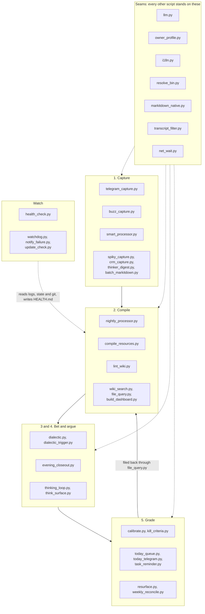

# The scripts

Every Python script in the engine, with three things for each: a **definition** (what
it is, in a sentence), a **description** (what it reads, what it writes, when it runs)
and a **philosophy** (why it is built the way it is). The third part is the one I would
read first. Code tells you what a script does. It rarely tells you what it refuses to
do, and most of the design here is refusal.

The scripts live in two places. `tools/` holds the core: the loop runs on one laptop
with nothing else. `.agents/scripts/` holds the workers and the addons: capture
channels, integrations and the watchers that keep an unattended machine honest.

## Eight habits the scripts share

Read these once and most of the individual philosophies become predictable.

1. **Propose, never write.** Human folders are human-authored. A script may draft a
   seed, a decision or a task, and it may nag. The paste is yours. The few scripts that
   do write into `Thinking/` do it only after an explicit "apply".
2. **Deterministic where possible, LLM only where something has to be read.** Dates,
   counts, votes, flags and deltas are computed in Python. A review date that was
   computed cannot be hallucinated.
3. **The LLM gets text, not tools.** Context is embedded in the prompt. Captures, web
   pages and e-mail bodies are untrusted input, so the model that reads them cannot run,
   write, fetch or delete anything.
4. **One seam per dependency.** One file knows the LLM provider, one knows the owner,
   one knows the language, one knows where the binaries are. Swapping any of them is a
   one-file job.
5. **Fail loudly, keep the input.** A failed call leaves the source where it was, for
   retry. Failures leave breadcrumbs that the health check turns red, and capture
   channels answer in the chat when they cannot process something.
6. **State is small, local and gitignored.** Seen ids, offsets and snapshots live in
   `.agents/state/`. Every scheduled job can run twice without doing its work twice.
7. **The first run sets a baseline.** A new ingest starts from now. It does not
   back-fill your history unless you ask, because nobody wants 219 Paul Graham essays
   summarised on a Tuesday morning.
8. **Wait for the network, or skip the tick.** A scheduled job that needs the network
   asks `net_wait.py` first. A laptop that just woke from sleep has its timers firing
   before the connection is back; rather than crash on the first call and cry wolf, the
   job skips this run and the next one picks the work up.

## The map



---

## Seams

### `tools/llm.py`

**Definition.** The only door to a language model. One function, `run_prompt(prompt)`,
returns a string or `None`.

**Description.** The provider comes from `BRAINLESS_LLM_PROVIDER`. `claude-cli` (the
default) shells out to `claude -p` with a pinned model, overridable through
`BRAINLESS_CLAUDE_MODEL`. `openai-compatible` talks to any `/chat/completions` endpoint
through `BRAINLESS_LLM_BASE_URL`, `_API_KEY` and `_MODEL`, using the standard library
only. `goose` runs `goose run` on the machine itself, which is how a lane stays off the
network entirely; see the [local inference guide](local-inference.md). Claude calls
always pass a deny list for the dangerous tools (Bash, Write, Edit, WebFetch and
friends), and deny beats allow. The default is no tools at all; a caller can open one
explicitly, such as Read for photo OCR. Goose calls pass `--no-profile`, which loads no
extensions, because an extension is how a Goose agent gets a shell. Every real call
writes a one-line breadcrumb to `.agents/state/llm_status` and a line to
`.agents/state/llm_log`, which keeps the last 300 calls with lane, provider and timing.

**Lanes.** Every call site passes `lane="<name>"` from the `LANES` table, and each lane
can be routed on its own with `BRAINLESS_LLM_PROVIDER_<LANE>` (dashes become
underscores), falling back to the global variable. `BRAINLESS_LLM_FALLBACK[_<LANE>]`
names a second provider to try when the first fails. `python3 tools/llm.py --lanes`
prints the current routing, `--probe <lane>` times one throwaway call.

**Philosophy.** Untrusted text flows into these prompts all day: Telegram messages,
transcripts, fetched pages, calendar invites. A model with tools would turn a poisoned
note into code execution, so the model gets none. The breadcrumb exists because of a
quieter failure. When authentication expires, every call returns an error and the
pipeline still looks green, so the health check reads the breadcrumb and goes red.
Callers never name a provider, which is why moving the whole batch brain off Claude
costs one file and not six. Lanes exist because that move should not be all or nothing:
a note classifier answering with one word out of three belongs on hardware you own, and
a Turkish weekly synthesis does not belong on a four bit four billion parameter model.
The fallback is deliberately one-directional. Cloud may degrade to local, which is
resilience; local may not escalate to cloud, because a lane pinned local was pinned for
privacy and a timeout is not consent.

### `tools/zk_id.py`

**Definition.** The slip-box addresses. Reports which notes are missing a permanent
`zk:` id and, with `--apply`, assigns them.

**Description.** An address is `YYYYMMDDHHmm`, derived from the note's own `date:`
frontmatter rather than the clock, so the same note gets the same address on every run.
An existing id is never touched and a collision walks forward a minute at a time.
`--check` exits non-zero when something is missing, for a scheduled job. Default output
is a report and nothing is written.

**Philosophy.** A permanent address is the one Zettelkasten mechanic that cannot be
bolted on later: an id that moves is worse than no id, because citations then point at
an address that has quietly become another note. The write is opt-in because `Thinking/`
belongs to the owner, and an agent assigning identities to someone's ideas without being
asked is exactly the line the ownership rule draws.

### `tools/owner_profile.py`

**Definition.** Who the vault belongs to and which language the machine should write in.

**Description.** Resolves `OWNER`, `LANG` and related fields in order: environment
(`BRAINLESS_OWNER_NAME`, `BRAINLESS_OUTPUT_LANG`), then the frontmatter of
`_Agent-Context/PROFILE.md`, then the defaults "the owner" and `en`. Also exposes
`lang_name()`, `output_lang_directive()` for prompts, the company area, the worker name
and the private folder names.

**Philosophy.** This file is the difference between a personal script collection and
software. Before it existed my name was in every prompt. Now a name appears in exactly
one private data file, which the public export replaces with a stub.

### `tools/i18n.py`

**Definition.** Locale strings for fixed, user-facing text: labels, headings and bot
replies.

**Description.** Strings live in `tools/locale/<lang>/<namespace>.json`, one flat
object per script. `t(key)` returns the string in the owner's language and falls back
to English. `t_list(key)` merges the current language with English, so parsers accept
headings in both. A missing key returns the key itself.

**Philosophy.** Prompts are English with an output-language directive, so only the
deterministic text needs translating, and a new language is a directory holding only
the keys somebody bothered to translate. The missing-key behaviour is deliberate. A
typo should be visible in the output, not raise an exception inside a job that runs at
05:00 with nobody watching.

### `tools/resolve_bin.py`

**Definition.** Finds external binaries without hardcoding a versioned path.

**Description.** `resolve_claude()` prefers `PATH`, then searches the installed node
versions for the `claude` binary.

**Philosophy.** A path such as `~/.nvm/versions/node/v22.19.0/bin/claude` works until
the day node is upgraded, and then every scheduled job fails at once. Thirty-two lines
to make that day uneventful.

### `tools/markitdown_native.py`

**Definition.** Document conversion through the MarkItDown library, in process.

**Description.** `convert_to_file(src, dst)` builds one `MarkItDown` instance lazily and
reuses it for every file in a run. Handles PDF, DOCX, XLSX, PPTX and the other formats
the library supports.

**Philosophy.** The earlier version shelled out to the CLI, which meant guessing where
pip had put it and paying a process spawn per file. Importing the library removes both
problems. The docstring carries a warning about `markitdown[all]` on Python 3.14,
learned by watching pip silently downgrade the package to 0.0.2.

### `tools/transcript_filter.py`

**Definition.** Decides whether a voice transcript contains anything at all.

**Description.** `is_empty_transcript(text)` returns True for literally empty text,
punctuation or bracket tags only, a known silence artefact, or one short token repeated.
The artefact patterns are per language, in `tools/locale/<lang>/transcript_filter.json`.

**Philosophy.** whisper.cpp does not return an empty string on silence. It hallucinates
subtitle credits, "[Music]" and invitations to subscribe, all of which pass a naive
`if not text` check and land in the vault as notes. The filter is conservative on
purpose and never rejects on length, because a genuine one-word memo is still a memo.

### `tools/net_wait.py`

**Definition.** Whether the machine can reach the network yet, in one place.

**Description.** `wait_for_network()` opens a throwaway TCP connection to a couple of
stable public addresses (1.1.1.1 and 8.8.8.8 on 443, then a DNS name so a resolver-only
outage counts too), retrying a few times with a short backoff, and returns True the
moment one answers. `network_up()` is the single-shot probe. Run as
`python3 tools/net_wait.py --wait` it exits 0 when the network is up and non-zero when it
is not, so a shell job can gate on it; with no argument it prints the current state. The
Python jobs call `wait_for_network()` directly, the shell workers gate on `--wait`.

**Philosophy.** A timer fires on a fixed cadence, including in the seconds after a laptop
wakes from sleep, before routing and the VPN are back. The first Google, Telegram or Buzz
call then dies with "network is unreachable", the unit fails, and the failure notifier
raises an alarm for a machine that is only still waking up. Every job that needs the
network asks this file first and, when the answer is no, skips the tick and leaves the
work for the next run. The probe dials IP literals so it needs no DNS of its own, and it
fails fast, because a job that blocks for a minute deciding whether the network is down is
its own kind of outage.

---

## 1. Capture

### `.agents/scripts/telegram_capture.py`

**Definition.** The phone's front door. Voice, text, photos and links sent to a Telegram
bot become notes.

**Description.** Polls the bot every two minutes. Voice notes, audio, video notes and
media documents are transcribed locally with whisper.cpp in the owner's language. Claude
cleans the transcript and corrects proper nouns against `CONTEXT.md`. Photos are read by
vision, and links are fetched only when the host is public, then written to
`Inbox/Links/`. Everything else lands in `Thinking/Daily/` with a confirmation reply.
Each turn is first offered to `thinking_loop.py` and `today_telegram.py`, in case the
message is an answer to one of their questions.

**Philosophy.** Audio never leaves the machine. Only one chat id is served; the first
sender ever becomes the whitelist and then it locks, so message the bot the minute you
create it. The part I care about most is the failure path. Telegram's offset advances
whether or not the handler succeeds, so a silently dropped message is gone for good.
Anything the handler cannot process is logged and answered in the chat.

### `.agents/scripts/buzz_capture.py`

**Definition.** The same front door, for a Buzz `#inbox` channel.

**Description.** Every two minutes on the worker it reads new posts from allowed
authors (the owner by default, more in `~/.config/brainless/buzz/capture_authors`),
handles voice, images, links and text exactly like the Telegram twin, writes to
`Thinking/Daily/`, and replies in the thread with the note title and path. State is a
seen-id file and a since-timestamp.

**Philosophy.** Two channels, one behaviour. It never raises to the caller. Every
failure is logged and, where possible, reported back into the thread, for the same
reason as above: a capture channel that drops things quietly teaches you to stop
trusting it, and then you stop capturing.

### `.agents/scripts/smart_processor.py`

**Definition.** The hourly document and image processor.

**Description.** Pulls with rebase and autostash, then walks the human homes. Supported
documents get a raw Markdown conversion in a sibling folder. High-value resources also
get a `Summary.md` and a `Fiche_de_Lecture.md`. Images dropped at the top of `Inbox/`
are OCR'd by Claude into `Thinking/Daily/`, with the original archived under
`_attachments/handwritten/`. `--images` is the watcher entry point that handles only the
images, and a lock stops the watcher and the hourly run from reading the same page
twice. Failing files enter `.agents/state/failed_conversions.json` and are retried on a
backoff of 1 hour, 4 hours, 12 hours, 1 day and 3 days, capped at a week.

**Philosophy.** Originals are never touched. LLM output is staged in a temporary
directory, validated as non-empty and current, and only then moved into place, so a
failed call cannot leave half a summary that the next run mistakes for a finished one.
The backoff exists because a corrupt PDF retried every hour is a bill, not a strategy.
The `git_sync` docstring records the four days in September when a bare `git pull`
failed every hour; the pull now aborts a half-finished rebase instead of leaving the
repo locked.

### `tools/batch_markitdown.py`

**Definition.** A one-off bulk converter for an existing pile of documents.

**Description.** Walks the company resources, `Library/`, `Personal/` and
`_attachments/`, and converts every supported file that does not already have a Markdown
sibling. No LLM, no summaries.

**Philosophy.** Bringing an old archive into the vault should not cost a model call per
file. Convert first, cheaply, and let the compiler decide later what deserves reading.

### `.agents/scripts/spiky_capture.py`

**Definition.** Meeting report ingest over IMAP.

**Description.** Polls a mailbox for meeting report e-mails and writes each as a
Markdown note under `Inbox/Spiky/`. State is the last processed IMAP UID. The first run
takes the current highest UID as its baseline; `--backfill N` also processes the last N
days. Credentials live in `~/.config/brainless/`, mode 0600.

**Philosophy.** The report is already complete in the mail body: summary, actions,
scores, transcript. So there is no LLM here and the cost is zero. I would rather parse
an e-mail than pay a model to tell me what the e-mail says.

### `.agents/scripts/crm_capture.py`

**Definition.** A read-only CRM snapshot. Pipedrive is the first provider.

**Description.** Pulls the owner's organisations and open deals and produces
`_Agent-Context/CRM.md` (a status block for the briefing, rewritten only when its body
changes), one event log per organisation under `Inbox/CRM/` (appended only when
something happens), a snapshot for the next delta and a status line for the health
check. Flags: `--dry-run`, `--self-test` (fixture, no network), `--no-activity-days`,
`--stage-days`, `--lang`. Without a token file it exits quietly. Details:
[addons/crm-pipedrive.md](addons/crm-pipedrive.md).

**Philosophy.** Person data is deliberately not fetched. The provider mapping passes
organisation and deal fields only, so the privacy boundary lives in code and cannot be
switched off in a settings file on a bad day. A quiet run touches nothing, because
every touch under `Inbox/` costs an LLM summary at compile time. Other CRMs plug in
behind a `Provider` class with five methods.

### `.agents/scripts/thinker_digest.py`

**Definition.** A weekly digest of the people you read.

**Description.** Fridays at 07:00 it scans the RSS and Atom feeds listed in
`_Agent-Context/thinkers.md`, fetches the full text of the few most important new posts,
folds in that week's `Inbox/Links/` notes, and writes one synthesis tied to your
projects.

**Philosophy.** Weekly, never urgent. No push notifications, by decision. X is not
scraped, because it is auth-gated, fragile and against the terms; if a thread matters
you send the link to the bot and the digest picks it up. The first run only sets a
baseline.

---

## 2. Compile

### `tools/nightly_processor.py`

**Definition.** The 23:00 job that turns the day's captures into one digest.

**Description.** Reads everything in `Thinking/Daily/`, asks the LLM for a digest with
action items, writes `.wiki/digests/<date>.md`, appends the action items to the task
ledger in its row format, moves the raw captures to `Archive/Daily-Captures/<date>/`,
then runs the compiler and the linter. The compile timeout is 90 minutes and
configurable through `BRAINLESS_COMPILE_TIMEOUT`.

**Philosophy.** Captures are archived only after the digest is safely on disk; a failed
digest leaves the day where it was and raises a notification. On an empty day the job
still prints a heartbeat line, because the health check judges liveness by the log's
age, and a job that is quiet and a job that is dead look identical otherwise. The
timeout used to be 30 minutes, until a backlog was cut short three nights running.

### `tools/compile_resources.py`

**Definition.** The compiler. Human folders in, `.wiki/` out.

**Description.** Five phases: summaries (one per source note), projects (a mirror per
`notes.md`, tracking every permitted source file beneath it), articles (clusters of
summaries), ideas (derived from beliefs and decisions) and the index, plus entity pages
from the registry. Incremental by default, using source digests and modification times.
Flags: `--full-rebuild`, `--dry-run`, `--only <phase>`.

**Philosophy.** `.wiki/` is disposable. Anything in it can be regenerated, which is what
lets the machine own a folder without anyone worrying about what it does there. Private
segments are checked for every descendant file and never reach a prompt or a hash.
Generated output is validated before it replaces an existing mirror, so a bad night
cannot destroy a good summary. It also carries one rule I insisted on: effects that
cross between personal and work get linked, because that is where my decisions
actually collide.

### `tools/lint_wiki.py`

**Definition.** Integrity checks for the compiled layer, with cautious repairs.

**Description.** Reports broken links, missing pages ranked by how often they are
wanted, orphan files, stale summaries and missing frontmatter, into
`.wiki/_lint-report.md`. `--fix` backfills frontmatter, `--fix-links` remaps path
mistakes, `--prune-links` also de-links unresolved targets, and `--dry-run` previews.

**Philosophy.** Report by default; the nightly run never fixes. The one destructive
option is off unless you ask twice. Unresolved links are counted as demand, since a
page that twelve notes point to and nobody has written is a to-do list and not an
error. Index links do not count as inbound, otherwise the generated index would hide
every orphan.

### `tools/wiki_search.py`

**Definition.** Search over `.wiki/`: ripgrep for candidates, a small BM25 to rank them.

**Description.** `python3 tools/wiki_search.py "query" --k 10 --json`. `--root` points
it at another folder. Slash commands and agents call it before they read the index.

**Philosophy.** No embeddings, no vector database, no service to keep alive. For a
personal vault, ripgrep and 125 lines are fast enough and have nothing to break. It is
also the only vault command the read-only personas are allowed to run.

### `tools/file_query.py`

**Definition.** The loopback. Files a command's output back into the wiki.

**Description.** Pipe Markdown in, with a command name and a title:
`echo "<output>" | python3 tools/file_query.py decide "Housing in London"`. It writes
`.wiki/digests/queries/<date>-<command>-<slug>.md` with frontmatter and prints the path.

**Philosophy.** An analysis that stays in a chat window is spent once. Filed, it is
visible to `/context`, `/trace`, `/weekly` and search, so tomorrow's question builds on
today's answer. Every thinking command ends with this step. Sixty-nine lines, and it is
what makes the wiki compound.

### `tools/build_dashboard.py`

**Definition.** The active-projects view, rebuilt from the project notes themselves.

**Description.** Scans every `Work/` and `Personal/` folder with a `notes.md`, plus
decisions and beliefs, and assembles the dashboard: time-sensitive items, active
projects with their next action and next kill criterion, open loops, nudges and the
archived list. Runs Monday 05:00 and Friday 21:00. No LLM.

**Philosophy.** A status page maintained by hand goes stale within a fortnight, so this
one is computed from the notes you were writing anyway. An explicit `## Next Action`
wins over guessed tasks. Kill criteria are kept out of the action list, because the
condition under which you would stop is not a thing to do.

---

## 3 and 4. Bet and argue

### `tools/dialectic.py`

**Definition.** The moderator of the six-persona debate.

**Description.** At 12:30 and 21:20 it clusters the day's captures into topics and runs
two rounds per topic. Round one is one root message per persona, so nobody can read
anybody else. Round two is one root quoting every round one reply. Replies end with
`Vote:` and `Number:`, and round two adds `New evidence:`. `score_topic()` turns those
lines into a scorecard, the moderator writes the synthesis, the note is filed, and the
round is appended to `.agents/state/dialectic_scores.jsonl`. A rolling 30 day view goes
to `_Agent-Context/DIALECTIC-SCORECARD.md`. On a silent day the evening run argues one
thing the vault is waiting on, rotated with a 14 day cooldown. Each topic is filed as two
pages and a folded transcript: a verdict computed from the final votes, the moderator's
conclusion and fields, the vote table and the proposal first; the method trace (research
question, hypotheses, tests, one row per persona) second; the raw rounds under a collapsed
callout. Flags: `--run noon|evening|night`, `--topic "<thesis>"`, `--local` (no Buzz),
`--parallel` (all personas at once; one at a time is the default), `--dry-run`,
`--scorecard`. `--run night` is the local-model experiment: see
[local inference](local-inference.md#the-night-window-experiment).

**Philosophy.** Isolated first rounds maximise the diversity of arguments; people and
models both anchor on whoever spoke first. The scoring is deterministic so that the
synthesis starts from counted votes. Two flags watch the debate itself: affirmation
above 60 per cent, and a persona that never votes NO. A panel that agrees with me too
easily is the failure I am most likely to enjoy, which is why a script checks for it.
The moderator never picks a side for you. It ends on what would have to be true and a
cheap, dated test.

### `tools/dialectic_trigger.py`

**Definition.** Starts a debate from the chat: post `!dialectic <thesis>` in the channel.

**Description.** Runs every 60 seconds, watches `#dialectic` and launches a full
moderated round. `--dry-run` detects and reports, `--self-test` checks the logic offline.

**Philosophy.** Three guards. Only a non-bot author can trigger, and a bot is any
identity with a key file on the machine, so the agents can never set each other off. A
`flock` keeps two rounds from overlapping. A seen-id file stops one command from firing
twice, and the first run seeds it so history never fires. Phrase the thesis as a claim;
a question gets you five polite essays.

### `tools/evening_closeout.py`

**Definition.** The 21:00 forcing function that appends a close-out to today's briefing.

**Description.** Reflects on the day (what happened, what carries over, open loops) and
proposes one candidate seed, one decision worth writing down and any contradiction
between today's actions and your written beliefs. Overdue reviews come from
`calibrate.scan()`. `--dry-run` prints instead of writing.

**Philosophy.** It only ever proposes. The single write is one section in the briefing
file, and nothing under `Thinking/`. The point is to make writing a seed a paste-away
and not a blank page. It skips the LLM entirely on idle days, and the calibration block
is computed in Python so it cannot be invented.

### `.agents/scripts/thinking_loop.py`

**Definition.** The weekly reflection question, asked where I actually answer: Telegram.

**Description.** `--ask` (Sunday 19:00) picks one question in priority order, such as
grading a decision, adding a missing prediction, challenging the stalest belief, the
next cadence step or a seed idea. You reply by voice or text. The LLM drafts the change
and sends a preview. "apply" writes it, "cancel" discards it, "skip" moves on to a
different kind of question next week. Also `--status`, `--dry-run` and
`--simulate "<answer>"`.

**Philosophy.** Reflection fails on friction, so it moved to the one channel I answer
on. This is one of the few scripts that writes into `Thinking/`, and it is fenced
accordingly. It writes only after "apply", only to paths from a fixed list (the model
cannot choose a file), and the model's output is parsed as JSON and sanitised first.

### `tools/think_surface.py`

**Definition.** A one-screen morning nudge, `_Agent-Context/THINKING.md`.

**Description.** Four blocks in leverage order: today's cadence step, the decision
scoreboard from `calibrate.py`, one provocation (context drift, a stale belief, a
missing prediction or a breached kill criterion) and the freshest resurfaced notes.
Runs each morning.

**Philosophy.** Fully deterministic. No model call means it is cheap and fast, and it
cannot fail silently. It is kept apart from the operational briefing on purpose. The
briefing is about what to do today; this is about whether I am still thinking. When the
cadence step has waited more than two weeks, it says so, in days.

---

## 5. Grade

### `tools/calibrate.py`

**Definition.** Finds the decisions that need attention. Read-only.

**Description.** Three lists: DUE TO GRADE (review date passed, outcome still pending),
NEEDS PREDICTION (decided, with no prediction or confidence) and NO REVIEW DATE. Run it
by hand as `brainless calibrate`; the dashboard, the think surface and the close-out
import its `scan()`.

**Philosophy.** Eighty-four lines, and the most valuable file in the repo if you use
it. Judgement compounds only when predictions meet outcomes, and most decision journals
die because nobody is ever asked to grade anything. It never grades for you.

### `tools/kill_criteria.py`

**Definition.** The quit rule, on rails.

**Description.** Any project `notes.md` may carry a `## Kill Criteria` section of
`- [ ] YYYY-MM-DD | condition | consequence` lines. The scan classifies them as
breached (date passed, box open), due soon or missing (an active project with no
criterion at all) and writes `_Agent-Context/KILL-CRITERIA.md`. A breach turns a health
row red and leads the dashboard. `--dry-run` prints only.

**Philosophy.** Annie Duke's point in *Quit*: decide the quit condition in advance,
with a date, because in the moment you never will. The script is pure date arithmetic,
so it has no opinion and no mercy.

### `tools/today_queue.py`

**Definition.** A bounded daily queue of at most three items: one decision, one
commitment, one piece of evidence to review.

**Description.** Selection is local, with no model calls. `brainless today` previews,
`--build` saves `TODAY.md` and the queue state, `--send` delivers to Telegram, and
`--action ID answer|apply|edit|defer|dismiss --text "..."` acts on an item. Full
behaviour: [today-queue.md](today-queue.md).

**Philosophy.** Bounded on purpose. Three items get done; a list of thirty gets
admired. Answers are previews until applied. A deferral needs a future date and a
dismissal needs a reason, and after repeated deferrals it asks for the blocker or a
smaller step. Writes are atomic and tied to a revision, so a stale button or a source
that changed underneath is rejected and nothing is applied twice.

### `tools/today_telegram.py`

**Definition.** The router for Today replies and buttons arriving over Telegram.

**Description.** `handle()` is called by the capture worker and claims a message only
when it is explicitly addressed to a Today item or carries a revision-bound button.

**Philosophy.** Narrow by design. Anything it does not recognise for certain falls
through and becomes an ordinary capture, because a thought swallowed by the wrong
handler is worse than an unanswered question.

### `.agents/scripts/task_reminder.py`

**Definition.** The morning entry point that sends the Today queue.

**Description.** Nineteen lines. The existing 08:00 reminder schedule calls it, and it
builds and sends today's items. Repeated runs do not resend.

**Philosophy.** It kept its old name and its old timer so that shipping the Today queue
required installing nothing new. The cheapest migration is the one nobody has to do.

### `tools/resurface.py`

**Definition.** Five old notes worth reading again this week.

**Description.** Mondays at 06:30 it picks five notes by relevance to the active
projects in `CONTEXT.md` and writes `_Agent-Context/RESURFACE.md`. Briefings include the
list while it is less than seven days old.

**Philosophy.** It counters the collector's fallacy, the belief that a note captured is
a note known. The LLM sees only titles and snippets embedded in the prompt, and the
single write is that one file.

### `tools/weekly_reconcile.py`

**Definition.** A weekly drift report between what the context file says and what
actually happened.

**Description.** Sundays at 20:00 it compares `_Agent-Context/CONTEXT.md` with the last
seven days of briefings, close-outs and commit subjects, and writes
`_Agent-Context/CONTEXT-DRIFT.md` with proposed updates.

**Philosophy.** Report only. `CONTEXT.md` is never modified, because a machine that
edits its own memory of you is a subtle way to end up with a stranger's context. You
apply or reject the proposals.

---

## Tasks, meetings and people

These are addons. None is needed for the loop.

### `.agents/scripts/spiky_actions.py`

**Definition.** Extracts action items from meeting reports into the task ledger.

**Description.** Feeds new `Inbox/Spiky/` notes to the LLM and appends rows to
`_Agent-Context/TASKS.md` in the format `- [ ] text | [[Meeting]] | YYYY-MM-DD`, under
Promises or Waiting. `--backfill N` handles first setup.

**Philosophy.** It extracts only two things: what I promised, and what I am waiting on
from others. A meeting produces many "actions", and most belong to somebody else. A
ledger that lists everyone's homework stops being read within a week.

### `.agents/scripts/gtasks_sync.py`

**Definition.** Two-way sync between the task ledger and Google Tasks.

**Description.** New local rows are added to Google, a local `[x]` completes the task
there, a completion on Google ticks the row locally, and a task added by hand on Google
drops into the matching section. Sections map to lists; headings are accepted in the
current language and in English.

**Philosophy.** The ledger stays plain Markdown and stays the source of truth. The
phone app is a convenient window onto it. It can disappear tomorrow and nothing is lost.

### `.agents/scripts/meeting_brief.py`

**Definition.** An automatic brief before each meeting.

**Description.** Every 15 minutes it looks for calendar events starting within about 45
minutes, gathers the attendees, the gist of past meeting reports and the related open
items in the ledger, compiles one brief and sends it over Telegram. Calendar access is
read-only, and each event is briefed once.

**Philosophy.** The vault already knows what I promised this person last time. The
useful moment to be reminded is ten minutes before I see them, and not during.

### `.agents/scripts/relationship_radar.py`

**Definition.** A weekly signal layer over the people you work with. No LLM.

**Description.** Computes last contact, cadence and score momentum from meeting notes,
and reciprocity (whom you owe, who owes you) from the ledger. Silence of 20 weeks is
yellow and 32 weeks is red; a momentum drop of 15 points or more is flagged. Output goes
to `.wiki/relationships/radar.md` and, on a deviation, to Telegram.

**Philosophy.** Relationships decay quietly and a calendar will not tell you. The
arithmetic is deterministic and the thresholds are ones I set by hand. It reports a
silence and leaves the phone call to you.

### `.agents/scripts/content_engine.py`

**Definition.** Weekly writing drafts from the week's material.

**Description.** Tuesdays at 09:00 it reads the week's meeting reports, links and
captures, produces two or three drafts in the voice of your production guide under
`Inbox/Content Drafts/`, and sends a summary to Telegram.

**Philosophy.** It never publishes. A draft is a proposal like any other, and the
decision is the owner's. The aim is to start from something on a Tuesday morning, and
the draft is expected to be rewritten.

---

## Watch

### `tools/health_check.py`

**Definition.** The pipeline's heartbeat, written to `_Agent-Context/HEALTH.md`.

**Description.** Hourly, with no LLM. It checks git freshness, the age and errors of
each job log, LLM authentication (through the breadcrumb), the CRM status line, the
morning briefing, kill criteria, the worker and the dialectic. It fires a notification
when a check crosses the two-day red line. `brainless health` runs it and prints the
result.

**Philosophy.** Automation fails silently by default. This one refuses to: briefings
must carry the health block at the top, so a broken pipe is the first thing I read in
the morning and not something I discover three weeks later.

### `.agents/scripts/watchdog.py`

**Definition.** The worker's hourly watch, reporting over Telegram.

**Description.** Checks for laptop silence (no non-worker commit reaching the remote in
26 hours), a red `HEALTH.md`, failed `brainless-*` units and LLM authentication errors.
With `--power`, every five minutes, it checks whether the charger has been unplugged or
the battery is low. The same topic is reported once per 12 hours.

**Philosophy.** Two machines watch each other, because each one's failures are
invisible from the inside. It only reads and messages, and never writes to the vault or
pushes. The power check is there because the always-on worker is a laptop, and a laptop
whose charger has been borrowed is always-on only until the battery runs out.

### `.agents/scripts/notify_failure.py`

**Definition.** An immediate Telegram alert when a systemd unit fails.

**Description.** Wired as `OnFailure=brainless-notify-failure@%n.service`. It receives
the failed unit's name and sends the status with a tail of the journal.

**Philosophy.** The watchdog sweeps hourly; this fires at once. It is best effort and
never raises, so a failure to notify cannot itself cascade into another failure.

### `.agents/scripts/update_check.py`

**Definition.** A weekly notice of pending system updates on an Arch worker.

**Description.** Counts pending packages with `checkupdates`, which needs no root, and
reports over Telegram when security-critical ones are among them.

**Philosophy.** It does not upgrade. On Arch an automatic or partial upgrade is how you
break a machine while asleep. The goal is only to prevent silent ageing; the decision
and the `pacman -Syu` stay with a human.

---

## Ship

### `tools/export_public.py`

**Definition.** Produces the public engine repo from a private vault.

**Description.** A whitelist copy of named directories and files into a fresh
directory, with private data files replaced by stubs and empty folders laid out for a
first clone. It then scans the result for identity numbers, keys, tokens, private
e-mail addresses and the owner's name, and exits non-zero on any finding. Without
`--out` it is a dry run. `--update` refreshes an existing checkout and keeps its git
history, and `--scan-only` is what the public CI runs on every push.

**Philosophy.** The public tree is never derived by deleting from the private one. A
blacklist fails open, since the file you forgot about ships. A whitelist fails closed.
History does not travel either, because `git log` has an excellent memory for things
you removed. The script touches no git commands; you review the report and you push.

---

## Tests

### `tools/tests/test_review_regressions.py`

**Definition.** Offline regressions for document retention, project privacy and
dashboard actions.

**Description.** Twenty-two cases. A failed or empty LLM output must keep the source
and the raw conversion and must not publish a partial summary; private descendants must
never reach a prompt or a hash; a project mirror must rebuild on change, addition,
rename and removal; kill criteria must never become tasks.

### `tools/tests/test_today_queue.py`

**Definition.** Offline regressions for the Today queue.

**Description.** Thirty cases. At most three items and no resends, partial delivery
retried for the unsent items only, previews that write nothing, idempotent apply, stale
buttons and changed sources rejected, deferral and dismissal rules.

**Philosophy, for both.** No credentials and no model calls, so they run anywhere,
including public CI:

```bash
python3 -B -m unittest discover -s tools/tests -v
```

Each test is a mistake that either happened or nearly did. They are less a proof that
the engine is correct and more a list of the ways it is no longer allowed to be wrong.
