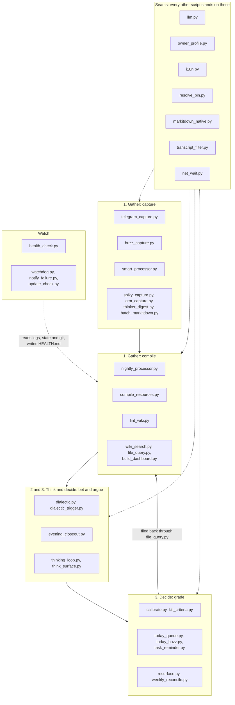

# The scripts

> **In the loop:** all four lines. Every script, grouped by the line it serves.

Every Python script in the engine, with three things for each: a **definition** (what
it is, in a sentence), a **description** (what it reads, what it writes, when it runs)
and a **philosophy** (why it is built the way it is). The third part is the one I would
read first. Code tells you what a script does. It rarely tells you what it refuses to
do, and most of the design here is refusal.

The scripts live in two places. `tools/` holds the core: the loop runs on one laptop
with nothing else. `.agents/scripts/` holds the workers and the addons: capture
channels, integrations and the watchers that keep an unattended machine honest.

## Eight habits the scripts share

Read these once and most of the individual philosophies become predictable.

1. **Propose, never write.** Human folders are human-authored. A script may draft a
   seed, a decision or a task, and it may nag. The paste is yours. The few scripts that
   do write into `Thinking/` do it only after an explicit "apply".
2. **Deterministic where possible, LLM only where something has to be read.** Dates,
   counts, votes, flags and deltas are computed in Python. A review date that was
   computed cannot be hallucinated.
3. **The LLM gets text, not tools.** Context is embedded in the prompt. Captures, web
   pages and e-mail bodies are untrusted input, so the model that reads them cannot run,
   write, fetch or delete anything.
4. **One seam per dependency.** One file knows the LLM provider, one knows the owner,
   one knows the language, one knows where the binaries are. Swapping any of them is a
   one-file job.
5. **Fail loudly, keep the input.** A failed call leaves the source where it was, for
   retry. Failures leave breadcrumbs that the health check turns red, and capture
   channels answer in the chat when they cannot process something.
6. **State is small, local and gitignored.** Seen ids, offsets and snapshots live in
   `.agents/state/`. Every scheduled job can run twice without doing its work twice.
7. **The first run sets a baseline.** A new ingest starts from now. It does not
   back-fill your history unless you ask, because nobody wants 219 Paul Graham essays
   summarised on a Tuesday morning.
8. **Wait for the network, or skip the tick.** A scheduled job that needs the network
   asks `net_wait.py` first. A laptop that just woke from sleep has its timers firing
   before the connection is back; rather than crash on the first call and cry wolf, the
   job skips this run and the next one picks the work up.

## The map



---

## Seams

### `tools/llm.py`

**Definition.** The only door to a language model. One function, `run_prompt(prompt)`,
returns a string or `None`.

**Description.** The provider comes from `BRAINLESS_LLM_PROVIDER`. `claude-cli` (the
default) shells out to `claude -p` with a pinned model, overridable through
`BRAINLESS_CLAUDE_MODEL`. `openai-compatible` talks to any `/chat/completions` endpoint
through `BRAINLESS_LLM_BASE_URL`, `_API_KEY` and `_MODEL`, using the standard library
only. `goose` runs `goose run` on the machine itself, which is how a lane stays off the
network entirely; see the [local inference guide](local-inference.md). Claude calls
always pass a deny list for the dangerous tools (Bash, Write, Edit, WebFetch and
friends), and deny beats allow. The default is no tools at all; a caller can open one
explicitly, such as Read for photo OCR. Goose calls pass `--no-profile`, which loads no
extensions, because an extension is how a Goose agent gets a shell. Every real call
writes a one-line breadcrumb to `.agents/state/llm_status` and a line to
`.agents/state/llm_log`, which keeps the last 300 calls with lane, provider and timing.

**Lanes.** Every call site passes `lane="<name>"` from the `LANES` table, and each lane
can be routed on its own with `BRAINLESS_LLM_PROVIDER_<LANE>` (dashes become
underscores), falling back to the global variable. `BRAINLESS_LLM_FALLBACK[_<LANE>]`
names a second provider to try when the first fails. `python3 tools/llm.py --lanes`
prints the current routing, `--probe <lane>` times one throwaway call.

**Philosophy.** Untrusted text flows into these prompts all day: Telegram messages,
transcripts, fetched pages, calendar invites. A model with tools would turn a poisoned
note into code execution, so the model gets none. The breadcrumb exists because of a
quieter failure. When authentication expires, every call returns an error and the
pipeline still looks green, so the health check reads the breadcrumb and goes red.
Callers never name a provider, which is why moving the whole batch brain off Claude
costs one file and not six. Lanes exist because that move should not be all or nothing:
a note classifier answering with one word out of three belongs on hardware you own, and
a Turkish weekly synthesis does not belong on a four bit four billion parameter model.
The fallback is deliberately one-directional. Cloud may degrade to local, which is
resilience; local may not escalate to cloud, because a lane pinned local was pinned for
privacy and a timeout is not consent.

### `tools/zk_id.py`

**Definition.** The slip-box addresses. Reports which notes are missing a permanent
`zk:` id and, with `--apply`, assigns them.

**Description.** An address is `YYYYMMDDHHmm`, derived from the note's own `date:`
frontmatter rather than the clock, so the same note gets the same address on every run.
An existing id is never touched and a collision walks forward a minute at a time.
`--check` exits non-zero when something is missing, for a scheduled job. Default output
is a report and nothing is written.

**Philosophy.** A permanent address is the one Zettelkasten mechanic that cannot be
bolted on later: an id that moves is worse than no id, because citations then point at
an address that has quietly become another note. The write is opt-in because `Thinking/`
belongs to the owner, and an agent assigning identities to someone's ideas without being
asked is exactly the line the ownership rule draws.

### `tools/owner_profile.py`

**Definition.** Who the vault belongs to and which language the machine should write in.

**Description.** Resolves `OWNER`, `LANG` and related fields in order: environment
(`BRAINLESS_OWNER_NAME`, `BRAINLESS_OUTPUT_LANG`), then the frontmatter of
`_Agent-Context/PROFILE.md`, then the defaults "the owner" and `en`. Also exposes
`lang_name()`, `output_lang_directive()` for prompts, the company area, the worker name
and the private folder names.

**Philosophy.** This file is the difference between a personal script collection and
software. Before it existed my name was in every prompt. Now a name appears in exactly
one private data file, which the public export replaces with a stub.

### `tools/i18n.py`

**Definition.** Locale strings for fixed, user-facing text: labels, headings and bot
replies.

**Description.** Strings live in `tools/locale/<lang>/<namespace>.json`, one flat
object per script. `t(key)` returns the string in the owner's language and falls back
to English. `t_list(key)` merges the current language with English, so parsers accept
headings in both. A missing key returns the key itself.

**Philosophy.** Prompts are English with an output-language directive, so only the
deterministic text needs translating, and a new language is a directory holding only
the keys somebody bothered to translate. The missing-key behaviour is deliberate. A
typo should be visible in the output, not raise an exception inside a job that runs at
05:00 with nobody watching.

### `tools/resolve_bin.py`

**Definition.** Finds external binaries without hardcoding a versioned path.

**Description.** `resolve_claude()` prefers `PATH`, then searches the installed node
versions for the `claude` binary.

**Philosophy.** A path such as `~/.nvm/versions/node/v22.19.0/bin/claude` works until
the day node is upgraded, and then every scheduled job fails at once. Thirty-two lines
to make that day uneventful.

### `tools/markitdown_native.py`

**Definition.** Document conversion through the MarkItDown library, in process.

**Description.** `convert_to_file(src, dst)` builds one `MarkItDown` instance lazily and
reuses it for every file in a run. Handles PDF, DOCX, XLSX, PPTX and the other formats
the library supports.

**Philosophy.** The earlier version shelled out to the CLI, which meant guessing where
pip had put it and paying a process spawn per file. Importing the library removes both
problems. The docstring carries a warning about `markitdown[all]` on Python 3.14,
learned by watching pip silently downgrade the package to 0.0.2.

### `tools/transcript_filter.py`

**Definition.** Decides whether a voice transcript contains anything at all.

**Description.** `is_empty_transcript(text)` returns True for literally empty text,
punctuation or bracket tags only, a known silence artefact, or one short token repeated.
The artefact patterns are per language, in `tools/locale/<lang>/transcript_filter.json`.

**Philosophy.** whisper.cpp does not return an empty string on silence. It hallucinates
subtitle credits, "[Music]" and invitations to subscribe, all of which pass a naive
`if not text` check and land in the vault as notes. The filter is conservative on
purpose and never rejects on length, because a genuine one-word memo is still a memo.

### `tools/net_wait.py`

**Definition.** Whether the machine can reach the network yet, in one place.

**Description.** `wait_for_network()` opens a throwaway TCP connection to a couple of
stable public addresses (1.1.1.1 and 8.8.8.8 on 443, then a DNS name so a resolver-only
outage counts too), retrying a few times with a short backoff, and returns True the
moment one answers. `network_up()` is the single-shot probe. Run as
`python3 tools/net_wait.py --wait` it exits 0 when the network is up and non-zero when it
is not, so a shell job can gate on it; with no argument it prints the current state. The
Python jobs call `wait_for_network()` directly, the shell workers gate on `--wait`.

**Philosophy.** A timer fires on a fixed cadence, including in the seconds after a laptop
wakes from sleep, before routing and the VPN are back. The first Google, Telegram or Buzz
call then dies with "network is unreachable", the unit fails, and the failure notifier
raises an alarm for a machine that is only still waking up. Every job that needs the
network asks this file first and, when the answer is no, skips the tick and leaves the
work for the next run. The probe dials IP literals so it needs no DNS of its own, and it
fails fast, because a job that blocks for a minute deciding whether the network is down is
its own kind of outage.

---

### `tools/hooks/claude_guard.py`

**Definition.** The vault's standing rules, enforced on every Claude Code tool call.

**Description.** `.claude/settings.json` wires three subcommands. Each reads the hook
JSON on stdin.

- `pre` runs before every Write, Edit, MultiEdit, NotebookEdit and Bash call:
  - **denied:** an em or en dash in new text, a file name, a command or a commit message;
  - **denied:** a real secret shape (private key, GitHub, Google, OpenAI, Slack or AWS
    token, JWT, bot token, TR IBAN), using the same patterns as the export leak scan;
  - **denied:** a dated briefing written anywhere except `Daily Briefings/`;
  - **ask first:** a write into a human area (the drafts folders are exempt);
  - **ask first:** a deletion outside the temp folders, or a git command that rewrites
    history.
- `post` sends a `.wiki` page back to the model when its frontmatter lacks `lang` or
  `summary_en`.
- `session` loads CONTEXT.md, PROJECTS-ACTIVE.md and LEARNINGS.md into every new session.

A dash that is already in a file does not block an edit next to it; only new ones count.
Each call takes about 25 ms.

**Philosophy.** A rule written in a prompt is a preference. An agent that can do the
wrong thing eventually will, in a context nobody predicted, and the dash rule proved it:
the model kept writing dashes through heredocs after being told not to. So the rules
became checks. The guard is silent when a call passes. It fails open: bad input or a bug
in the checker exits 0, so only the check itself can block and never the machinery around
it. It makes no judgement calls. Style, privacy tiers and filing need judgement and stay
in the prompts and in the editor lint. Human areas get a question, not a refusal, because
the rule is "ask first", not "never".

---

## 1. Gather: capture

### `.agents/scripts/telegram_capture.py`

**Definition.** The phone's front door. Voice, text, photos and links sent to a Telegram
bot become notes.

**Description.** Polls the bot every two minutes. Voice notes, audio, video notes and
media documents are transcribed locally with whisper.cpp in the owner's language. Claude
cleans the transcript and corrects proper nouns against `CONTEXT.md`. Photos are read by
vision, and links are fetched only when the host is public, then written to
`Inbox/Links/`. Everything else lands in `Thinking/Daily/` with a confirmation reply.
Telegram is capture-only. Raw updates are journaled before the polling offset
advances; failed processing retries from that journal. Receipts, setup notices and
errors go to Buzz #inbox. No Telegram replies, callbacks or approval handlers run.
See [Buzz interactions](buzz-interactions.md).

### `.agents/scripts/buzz_capture.py`

**Definition.** The same front door, for a Buzz `#inbox` channel.

**Description.** Every two minutes on the worker it reads new posts from allowed
authors (the owner by default, more in `~/.config/brainless/buzz/capture_authors`),
handles voice, images, links and text exactly like the Telegram twin, writes to
`Thinking/Daily/`, and replies in the thread with the note title and path. State is a
seen-id file and a since-timestamp. It also takes documents, which Telegram does not:
a PDF, DOCX, XLSX, PPTX or EPUB attachment (recognised by MIME type, URL or the imeta
`filename`) is converted with `markitdown_native` into `Inbox/Documents/`, and only the
Markdown reaches git. A name or caption matching a private name part is refused
before the download.

**Philosophy.** Two channels, one behaviour. It never raises to the caller. Every
failure is logged and, where possible, reported back into the thread, for the same
reason as above: a capture channel that drops things quietly teaches you to stop
trusting it, and then you stop capturing.

### `tools/media_import.py`

**Definition.** YouTube videos and podcast episodes in, as dated, timestamped transcripts.

**Description.** A YouTube or Apple Podcasts link shared in Telegram or Buzz is only queued,
and the capture answers at once. The `brainless-media` timer on the worker runs one job
every 10 minutes:

- **YouTube:** `yt-dlp` fetches the captions, uploaded ones before automatic ones, with no
  video download. When a video has no captions, the audio goes through Whisper.
- **Apple Podcasts:** the episode id in the link resolves through Apple's public lookup API
  to the show's own MP3. `whisper-cli` then transcribes it on the machine, with the same
  model as voice notes.

A cleaning pass adds punctuation, paragraphs and speaker turns without cutting anything. It
keeps a `[mm:ss]` marker every three minutes, plus YouTube's chapter headings. The result
lands in `Inbox/Media/` with title, show, URL, date and duration, and the nightly compile
picks it up. Buzz #inbox says when it is ready. Sharing the same link twice makes one job.
A show link without an episode, or anything over four hours, is refused with a reason.
`add <url>` queues a link by hand.

**Philosophy.** An hour of talk leaves almost nothing a week later, and a transcript is the
text the vault can use. Capture stays instant because transcription can take an hour. The
audio never leaves the machine. The timestamps matter more than they look: a claim the
wiki attributes to minute 34 can be checked in ten seconds, and one without a timestamp
never gets checked.

---

### `.agents/scripts/smart_processor.py`

**Definition.** The hourly document and image processor.

**Description.** Pulls with rebase and autostash, then walks the human homes. Supported
documents get a raw Markdown conversion in a sibling folder. High-value resources also
get a `Summary.md` and a `Fiche_de_Lecture.md`. Images dropped at the top of `Inbox/`
are OCR'd by Claude into `Thinking/Daily/`, with the original archived under
`_attachments/handwritten/`. `--images` is the watcher entry point that handles only the
images, and a lock stops the watcher and the hourly run from reading the same page
twice. Failing files enter `.agents/state/failed_conversions.json` and are retried on a
backoff of 1 hour, 4 hours, 12 hours, 1 day and 3 days, capped at a week.

**Philosophy.** Originals are never touched. LLM output is staged in a temporary
directory, validated as non-empty and current, and only then moved into place, so a
failed call cannot leave half a summary that the next run mistakes for a finished one.
The backoff exists because a corrupt PDF retried every hour is a bill, not a strategy.
The `git_sync` docstring records the four days in September when a bare `git pull`
failed every hour; the pull now aborts a half-finished rebase instead of leaving the
repo locked.

### `tools/batch_markitdown.py`

**Definition.** A one-off bulk converter for an existing pile of documents.

**Description.** Walks the company resources, `Library/`, `Personal/` and
`_attachments/`, and converts every supported file that does not already have a Markdown
sibling. No LLM, no summaries.

**Philosophy.** Bringing an old archive into the vault should not cost a model call per
file. Convert first, cheaply, and let the compiler decide later what deserves reading.

### `.agents/scripts/spiky_capture.py`

**Definition.** Meeting report ingest over IMAP.

**Description.** Polls a mailbox for meeting report e-mails and writes each as a
Markdown note under `Inbox/Spiky/`. State is the last processed IMAP UID. The first run
takes the current highest UID as its baseline; `--backfill N` also processes the last N
days. Credentials live in `~/.config/brainless/`, mode 0600.

**Philosophy.** The report is already complete in the mail body: summary, actions,
scores, transcript. So there is no LLM here and the cost is zero. I would rather parse
an e-mail than pay a model to tell me what the e-mail says.

### `.agents/scripts/crm_capture.py`

**Definition.** A read-only CRM snapshot. Pipedrive is the first provider.

**Description.** Pulls the owner's organisations and open deals and produces
`_Agent-Context/CRM.md` (a status block for the briefing, rewritten only when its body
changes), one event log per organisation under `Inbox/CRM/` (appended only when
something happens), a snapshot for the next delta and a status line for the health
check. Flags: `--dry-run`, `--self-test` (fixture, no network), `--no-activity-days`,
`--stage-days`, `--lang`. Without a token file it exits quietly. Details:
[the CRM snapshot addon](addons/crm-pipedrive.md).

**Philosophy.** Person data is deliberately not fetched. The provider mapping passes
organisation and deal fields only, so the privacy boundary lives in code and cannot be
switched off in a settings file on a bad day. A quiet run touches nothing, because
every touch under `Inbox/` costs an LLM summary at compile time. Other CRMs plug in
behind a `Provider` class with five methods.

### `.agents/scripts/thinker_digest.py`

**Definition.** A weekly digest of the people you read.

**Description.** Fridays at 07:00 it scans the RSS and Atom feeds listed in
`_Agent-Context/thinkers.md`, fetches the full text of the few most important new posts,
folds in that week's `Inbox/Links/` notes, and writes one synthesis tied to your
projects.

**Philosophy.** Weekly, never urgent. No push notifications, by decision. X is not
scraped, because it is auth-gated, fragile and against the terms; if a thread matters
you send the link to the bot and the digest picks it up. The first run only sets a
baseline.

---

## 1. Gather: compile

### `tools/nightly_processor.py`

**Definition.** The 23:00 job that turns the day's captures into one digest.

**Description.** Reads everything in `Thinking/Daily/`, asks the LLM for a digest with
action items, writes `.wiki/digests/<date>.md`, appends the action items to the task
ledger in its row format and moves the raw captures to `Archive/Daily-Captures/<date>/`.
The compile no longer runs here; see `tools/nightly_compile.py`.

**Philosophy.** Captures are archived only after the digest is safely on disk; a failed
digest leaves the day where it was and raises a notification. On an empty day the job
still prints a heartbeat line, because the health check judges liveness by the log's
age, and a job that is quiet and a job that is dead look identical otherwise.

### `tools/nightly_compile.py`

**Definition.** The 23:20 job that keeps `.wiki/` current, every night.

**Description.** Runs `compile_resources.py` inside its own budget, writes the change
brief (`wiki_changes.py`), refreshes the lint report, rebuilds the semantic index and the
link suggestions, and scores the retrieval questions. The run log gets `compile_rc`,
`wiki_changed` and `hit5`; a non-zero compile marks the run partial, and seven nights in a
row with `wiki_changed=0` turn HEALTH.md yellow. The compile timeout is 90 minutes (`BRAINLESS_COMPILE_TIMEOUT`), the budget ten
minutes less (`BRAINLESS_COMPILE_BUDGET`). On the worker it is `brainless-compile.timer`;
on a Mac, `install.sh --schedule` adds a launchd agent at the same time.

**Philosophy.** The compile used to sit at the end of the digest job, so it ran only on
nights with captures and a good summary. A quiet day, or a failed digest, left the week's
edits in `Work/` and `Library/` out of the wiki, and search went stale with them. Edits
and captures are different doors; neither should wait for the other. The timeout used to
be 30 minutes, until a backlog was cut short three nights running.

### `tools/wiki_changes.py`

**Definition.** What last night's compile did, in one short page.

**Description.** `nightly_compile.py` snapshots `.wiki/` before the compile and diffs it
after: pages added, updated and removed per kind (concepts, summaries, entities, projects,
ideas, maps of content, relationships), wikilinks gained, and new bullets under a concept
page's Contested and Superseded headings. No model is involved. Pages git ignores are left
out. The result overwrites `_Agent-Context/WIKI-CHANGES.md`, which the morning briefing
reads; a new contested or superseded claim becomes a quick action for the owner. Run by
hand with `python3 tools/wiki_changes.py --since <git ref>` to see the change since any
commit.

**Philosophy.** The compile runs while the owner sleeps and touches dozens of pages. A
loop that changes what you know without telling you is one you stop trusting, and a
contradiction filed in a page nobody opens has not been flagged at all. The brief costs
nothing to produce, so it runs every night, including the nights it has nothing to say.

### `tools/compile_resources.py`

**Definition.** The compiler. Human folders in, `.wiki/` out.

**Description.** The phases run in this order:

1. summaries: one per source note.
2. concept-assign: each summary gets the concepts it informs, from the registry in
   `_Agent-Context/concepts.md`.
3. concepts: each concept page is updated in place from the summaries it has not seen yet.
4. projects: a mirror per `notes.md`, tracking every permitted source file beneath it.
5. entities: pages built from the entity registry.
6. link: a deterministic linker. It turns the first mention of a registered entity or an
   active concept in summaries and filed queries into a link. It uses no model, creates no
   page and rewrites no text. A bare first name that runs straight into another capitalised
   word is someone else and gets no link.
7. ideas: derived from beliefs and decisions.
8. index.

A project mirror that shares its name with an entity page is written as
`<Name> (project).md` and links to the entity, so a `[[Name]]` link is never ambiguous.

It is incremental by default, using source digests and modification times. The flags are
`--full-rebuild`, `--dry-run` and `--only <phase>`. Two phases run only when named:

- `concept-propose` suggests a starting set of concepts.
- `concept-migrate` turned the old articles into concepts.

**Concept pages.** A summary says what one source said. A concept page says what the vault
knows about one idea, and each new source updates it instead of adding a page beside it.

- **Disagreements.** When a source disagrees with the page, both positions are kept with
  their sources and dates. An outdated claim is struck through and kept, never deleted.
- **Confidence.** Every claim carries a label: primary, secondary, self-reported or
  unverified.
- **Validator.** The model rewrites the whole page, so a deterministic check in
  `tools/concepts.py` refuses any rewrite that loses a struck claim or a cited source, uses
  a dash, or shrinks the page. The old page stays in place.
- **Proposals.** The compiler proposes new concepts in #thinking. A concept becomes active
  only when I change its registry row to active. Concepts built on family or health sources
  are marked personal: Buzz only counts them, and they are never exported.

**Philosophy.** `.wiki/` is disposable. Anything in it can be regenerated, which is what
lets the machine own a folder without anyone worrying about what it does there. Private
segments are checked for every descendant file and never reach a prompt or a hash.
Generated output is validated before it replaces an existing mirror, so a bad night
cannot destroy a good summary. It also carries one rule I insisted on: effects that
cross between personal and work get linked, because that is where my decisions
actually collide.

### `tools/lint_wiki.py`

**Definition.** Integrity checks for the compiled layer, with cautious repairs.

**Description.** Reports broken links, missing pages ranked by how often they are
wanted, orphan files, stale summaries and missing frontmatter, into
`.wiki/_lint-report.md`. `--fix` backfills frontmatter, `--fix-links` remaps path
mistakes, `--prune-links` also de-links unresolved targets, and `--dry-run` previews.

**Philosophy.** Report by default; the nightly run never fixes. The one destructive
option is off unless you ask twice. Unresolved links are counted as demand, since a
page that twelve notes point to and nobody has written is a to-do list and not an
error. Index links do not count as inbound, otherwise the generated index would hide
every orphan.

### `tools/wiki_metrics.py` and `tools/wiki_dedupe.py`

**Definition.** Whether the wiki is still a graph, and which of its pages are probably one page.

**Description.** `wiki_metrics` reads the same link graph as lint and computes:

- the orphan rate (healthy under 5%, red over 15%);
- links per page (healthy 3 to 8);
- the share of pages in the largest connected component (healthy 80% or more);
- the concept pages not compiled for 90 days;
- the three bridge pages with the highest betweenness.

`wiki_dedupe` proposes merges from four signals:

- **alias:** two pages answer to the same name;
- **title:** the titles nearly match;
- **clash:** an entity and a project mirror share a file name, so `[[links]]` are ambiguous;
- **inbound:** concept or idea pages are linked from the same sources.

Both feed `.wiki/_lint-report.md`. The Sunday scorecard keeps 26 weeks of the graph numbers,
and `health_check` turns them into a row in HEALTH.md.

**Philosophy.** Using the vault day to day never shows that linking has stopped working.
Ingestion keeps writing pages, and a growing share of them become unreachable. Only the
direction of these numbers shows it. Merging stays a human decision, because two pages that
look alike are often a general case and a specific one, and a merge cannot be undone by
reading a diff.

### `tools/link_suggest.py`

**Definition.** Pages that mean the same thing but do not link.

**Description.** It reads the semantic index and the lint link graph, and writes
`.wiki/_link-suggestions.md` (gitignored, out of the graph). A pair is proposed when each
page is among the other's five nearest and the similarity is in the top 1% of all pairs.
Three sections: homes for orphan pages, new links between connected pages, and
near-identical pairs (raw twins, one meeting captured twice) for the dedupe procedure.
Pairs that cross source folders come first. The nightly job rebuilds it after the index.
`--json` gives the full lists.

**Philosophy.** The linker ties pages through names, and four in ten pages still had no
link at all (2026-09-23). A Spiky meeting and a partnership note about one integration
often share no name. Meaning is the missing signal. The tool proposes and never writes: a
wrong link is cheap to refuse and expensive to find later. The cutoff is a percentile, not a
fixed score, because every model scores on its own scale.


### `tools/dreaming.py`

**Definition.** A nightly pass that turns link suggestions into proposals I approve on Buzz.

**Description.** At 04:00 on the worker it takes the top candidates from
`link_suggest.py`, minus every pair already decided. A model reads both pages' opening
passages and answers `link`, `duplicate` or `none`, with one sentence why. Each `link` and
at most one `duplicate` a night become a preview in `#dreaming`: both paths, the reason,
the evidence as `path:line`, and the exact line each page would gain. I reply `evet`,
`hayır` or `atla`.

- **Approved link:** a row in `_Agent-Context/links.md`, and `- [[other]]: reason` under
  both pages' links heading. The compiler's link phase rewrites every approved row on each
  compile, so a recompiled summary keeps its links.
- **Approved duplicate:** a `merge` row and a link both ways. Nothing is deleted; the merge
  is mine to do.
- **Rejected:** recorded, never asked again. A `none` from the judge is remembered for 60 days.
- **Bounds:** five proposals a night, one duplicate, 2N judge calls, no new proposals while
  ten wait, expiry after 14 days.
- **Kill rule:** under 30% approved across ten or more decisions in 14 days, and it stops
  and says so in `#dreaming`.

Setup on the worker: `bash .agents/buzz/install_dreaming_channel.sh`, then
`bash .agents/systemd/install.sh`. `--dry-run` judges and prints without asking.

**Philosophy.** Nearness is a candidate, not a reason: two people on one team sit close
because their pages share a template. So a model reads the pair, and I decide. A link
typed into a summary would vanish at its next recompile, which is why approvals live in a
registry the compiler replays. Asking five times a night is a budget of attention, and the
kill rule is there because a proposer I keep saying no to is worse than none.

---

### `tools/retrieval_eval.py`

**Definition.** Whether asking the vault still finds the right page.

**Description.** The questions live in `_Agent-Context/retrieval-golden.json`, which is
private because it names real pages. There are 34, each written the way I would ask it,
with the pages that answer it and a kind (name, paraphrase, crosslang, claim) that splits
the score, because a search change usually helps one kind and costs another. The eval runs them through `wiki_search.search()`,
the same entry point an agent uses, and reports three numbers: hit@1, hit@5 and MRR@10.

- **Last run:** kept in `.agents/state/`, so a change names the questions that moved, not
  just the average.
- **Nightly:** the job runs the set after the compile and puts `hit5` in its run log.
  `health_check` warns when hit@5 falls 15 points below its best of the fortnight.
- **Floor:** `--min-hit5 N` exits non-zero below that score, for use as a gate.

**Philosophy.** Search degrades without an error. A compile change reshapes the summaries,
or a prune archives the page one question depended on, and every answer still reads
fluently. A fixed set of questions scored the same way every night is the only thing that
notices. The questions are written in my words, not the pages', because that gap is the
whole job of search. A vault page must never quote a golden question: the page then
outranks the answer and the eval measures the quote. When a miss is really a wrong expectation, the fix is to widen the
expected pages. Rewording the question until it passes would defeat the test.

---

### `tools/run_log.py`

**Definition.** One line per scheduled run, with what the run actually did.

**Description.** `worker_job.sh` and `cron_wrapper.sh` run each job through
`run_log.py exec -- ...`. The wrapper streams the job's output and returns its exit code
unchanged. It also keeps the last `RUNLOG k=v` line the job printed and records the run in
`.agents/state/runs.jsonl`.

A 14-day rollup goes to `_Agent-Context/RUNS-<host>.md`, one file per machine so the two
never race. `health_check` reads both files and warns in three cases:

- a job's last run failed;
- a job went quiet for 2.5 times its usual gap;
- a capture path returned zero for days (nightly captures for 3 days, Spiky reports for 7).

The nightly processor now exits 1 when the digest fails, and it reports the compiler's exit
code instead of dropping it.

**Philosophy.** An exit code only says a job did not crash. The failure that hides is the
run that finishes and does nothing, night after night. Counting the work turns that into a
row that is visible the next morning.

---

### `tools/chat_import.py`

**Definition.** Chat history from Claude or ChatGPT, filtered on the way in.

**Description.** It has three commands:

- `triage` lists every conversation and writes nothing.
- `import` writes one file per conversation to `raw/chats/<source>/`. It skips short and
  personal conversations, redacts secret shapes, and re-running it changes nothing.
- `promote` moves the conversations worth compiling to `Library/Chats/`. The compiler
  summarises those around what I was working out and what I concluded, with the date.

**Philosophy.** Chat logs record me thinking, which makes them valuable, and they are the
most sensitive material I have. Redacting after ingest does not work, because by then the
text has spread into summaries and links. So the decision about what lands is made before
anything lands.

---

### `tools/output_guard.py` and `tools/graph_export.py`

**Definition.** A check that stops the model's talk about itself from becoming a wiki
page, and the link graph as a file Gephi opens ready to look at.

**Description.** The guard looks at the start and end of a page for the model narrating its
tools or delivery ("Write is disabled in this session, so I'll output…", "here is the
compiled…", "please approve the write"). It also looks for a second frontmatter block
nested in the body. Code blocks are skipped, so a template or a proposal can show
frontmatter. It is applied in four places:

- the compiler refuses to write such output, and the page it had stays;
- the concept validator rejects it;
- the nightly digest treats it as no digest;
- lint lists the pages already on disk. With `--fix`, compiled pages are queued for
  recompile; digests and filed queries need a hand edit.

`graph_export.py` writes GEXF, or GraphML with `--format graphml`, into `logs/graph/`.
Colours mark the page type and sizes follow link count. Each node carries its degree,
betweenness, component size and an orphan flag, so Gephi can filter and rank without
setup. `--no-summaries --main-only` gives the concept graph without the islands.

**Philosophy.** A sentence like "Write is disabled" is harmless in a terminal. In a wiki it
becomes the page's summary, its line in the index and what search matches. Ten pages
carried one, one of them for a month, and nothing errored. A pattern check at the moment of
writing costs nothing and catches the whole class. The export exists because the Obsidian
graph view computes nothing: the bridges and the islands are numbers, and a picture made
from those numbers is worth more than the default hairball. The file stays on this machine,
because its labels are real names.

---

### `tools/wiki_search.py`

**Definition.** Search over `.wiki/`: BM25 on the words, fused with local embeddings on
the meaning when the search addon is installed.

**Description.** `python3 tools/wiki_search.py "query" --k 10 --json`. `--root` points
it at another folder. Slash commands and agents call it before they read the index.

- **Hybrid (default with an index):** BM25 and `semantic_index.py` each rank every page;
  reciprocal rank fusion merges the two lists. About 1.3 seconds a query, model load
  included.
- **BM25 (default without one):** the original ripgrep and BM25, nothing to install.
- **Passage-level sources:** every result carries the passage that matched (the one the
  embedding chose, else the one holding most query words), the line of the match and the
  last `[mm:ss]` marker before it. An agent cites `path:line`, and a claim can be checked
  at its source in one jump. The ranking does not change.
- **`BRAINLESS_SEARCH=bm25|hybrid|rerank`** forces a mode. `rerank` adds a local
  cross-encoder over the fused top 30; it measured worse and slower, so it stays opt-in.

**Philosophy.** This used to say no embeddings, and BM25 alone was enough until the
questions stopped sharing words with the pages. I ask in Turkish about an English book,
say "medical cover" where the memo says "health insurance", describe a role without its
name. On the 34 golden questions (2026-09-23) hybrid moved MRR from 74 to 87 and hit@1
from 62% to 79%, and it beat BM25 on every kind of question. It stays an addon: the
model runs locally, so no vault text reaches an API, and without it search falls back
to BM25 rather than failing. It is also the only vault command the read-only personas
are allowed to run.

### `tools/semantic_index.py`

**Definition.** The embedding index behind hybrid search.

**Description.** `python3 tools/semantic_index.py build` embeds each wiki page as
passages (title and `summary_en` lead the first) with `intfloat/multilingual-e5-large`
through fastembed, on the CPU, and stores the vectors in `.agents/state/semantic/`.
Only pages whose text changed are embedded again; the nightly job runs the build after
the compile. The first build downloads a 2 GB model and takes about 20 minutes on an
M4 Pro. Install with `pip install -r requirements-search.txt`.

**Philosophy.** The model was chosen by the eval, not by reputation. A smaller
multilingual model (paraphrase-mpnet) made search worse than BM25 alone, MRR 59, because
it reads only the first 128 tokens of a passage. Every model change goes through
`retrieval_eval.py` first.

### `tools/mcp_server.py`

**Definition.** The wiki, read-only, for any MCP client.

**Description.** Three tools: `search` (the same `search()` the eval scores, with the
matching passage and its line), `read_page` and `index`. Over stdio by default; `--http <tailscale-ip>:8765` serves Streamable HTTP
with a bearer token from `~/.config/brainless/mcp_token`. On the worker,
`brainless-mcp.service` runs it. It refuses to bind to all interfaces. A second
machine on the tailnet connects with the token copied into its own config, for
Claude Code:
`claude mcp add --scope local --transport http brainless-wiki http://<tailscale-ip>:8765/mcp --header "Authorization: Bearer <token>"`.

**Philosophy.** An agent outside the vault should ask it the way an agent inside does,
through search and compiled pages. What git would not push, the server does not serve:
every path is checked against `.gitignore` and a hard-coded deny list, so a child's pages,
finance resources and the archive stay home. It has no write tool.

### `tools/file_query.py`

**Definition.** The loopback. Files a command's output back into the wiki.

**Description.** Pipe Markdown in, with a command name and a title:
`echo "<output>" | python3 tools/file_query.py decide "Housing in London"`. It writes
`.wiki/digests/queries/<date>-<command>-<slug>.md` with frontmatter and prints the path.

**Philosophy.** An analysis that stays in a chat window is spent once. Filed, it is
visible to `/context`, `/trace`, `/weekly` and search, so tomorrow's question builds on
today's answer. Every thinking command ends with this step. Sixty-nine lines, and it is
what makes the wiki compound.

### `tools/build_dashboard.py`

**Definition.** The active-projects view, rebuilt from the project notes themselves.

**Description.** Scans every `Work/` and `Personal/` folder with a `notes.md`, plus
decisions and beliefs, and assembles the dashboard: time-sensitive items, active
projects with their next action and next kill criterion, open loops, nudges and the
archived list. Runs Monday 05:00 and Friday 21:00. No LLM.

**Philosophy.** A status page maintained by hand goes stale within a fortnight, so this
one is computed from the notes you were writing anyway. An explicit `## Next Action`
wins over guessed tasks. Kill criteria are kept out of the action list, because the
condition under which you would stop is not a thing to do.

---

## 2 and 3. Think and decide: bet and argue

### `tools/dialectic.py`

**Definition.** The moderator of the six-persona debate.

**Description.** At 12:30 and 21:20 it clusters the day's captures into topics and runs
two rounds per topic. Round one is one root message per persona, so nobody can read
anybody else. Round two is one root quoting every round one reply. Replies end with
`Vote:` and `Number:`, and round two adds `New evidence:`. `score_topic()` turns those
lines into a scorecard, the moderator writes the synthesis, the note is filed, and the
round is appended to `.agents/state/dialectic_scores.jsonl`. A rolling 30 day view goes
to `_Agent-Context/DIALECTIC-SCORECARD.md`. On a silent day the evening run argues one
thing the vault is waiting on, rotated with a 14 day cooldown. Each topic is filed as two
pages and a folded transcript: a verdict computed from the final votes, the moderator's
conclusion and fields, the vote table and the proposal first; the method trace (research
question, hypotheses, tests, one row per persona) second; the raw rounds under a collapsed
callout. Flags: `--run noon|evening|night`, `--topic "<thesis>"`, `--local` (no Buzz),
`--parallel` (all personas at once; one at a time is the default), `--dry-run`,
`--scorecard`. `--run night` is the local-model experiment: see
[local inference](local-inference.md#the-night-window-experiment).

**Philosophy.** Isolated first rounds maximise the diversity of arguments; people and
models both anchor on whoever spoke first. The scoring is deterministic so that the
synthesis starts from counted votes. Two flags watch the debate itself: affirmation
above 60 per cent, and a persona that never votes NO. A panel that agrees with me too
easily is the failure I am most likely to enjoy, which is why a script checks for it.
The moderator never picks a side for you. It ends on what would have to be true and a
cheap, dated test.

### `tools/dialectic_trigger.py`

**Definition.** Starts a debate from the chat: post `!dialectic <thesis>` in the channel.

**Description.** Runs every 60 seconds, watches `#dialectic` and launches a full
moderated round. `--dry-run` detects and reports, `--self-test` checks the logic offline.

**Philosophy.** Three guards. Only a non-bot author can trigger, and a bot is any
identity with a key file on the machine, so the agents can never set each other off. A
`flock` keeps two rounds from overlapping. A seen-id file stops one command from firing
twice, and the first run seeds it so history never fires. Phrase the thesis as a claim;
a question gets you five polite essays.

### `tools/evening_closeout.py`

**Definition.** The 21:00 forcing function that appends a close-out to today's briefing.

**Description.** Reflects on the day (what happened, what carries over, open loops) and
proposes one candidate seed, one decision worth writing down and any contradiction
between today's actions and your written beliefs. Overdue reviews come from
`calibrate.scan()`. `--dry-run` prints instead of writing.

**Philosophy.** It only ever proposes. The single write is one section in the briefing
file, and nothing under `Thinking/`. The point is to make writing a seed a paste-away
and not a blank page. It skips the LLM entirely on idle days, and the calibration block
is computed in Python so it cannot be invented.

### `.agents/scripts/thinking_loop.py`

**Definition.** The weekly reflection question, asked in Buzz #thinking.

**Description.** `--ask` (Sunday 19:00) picks one question in priority order, such as
grading a decision, adding a missing prediction, challenging the stalest belief, the
next cadence step or a seed idea. You reply by voice or text. The LLM drafts the change
and sends a preview. "apply" writes it, "cancel" discards it, "skip" moves on to a
different kind of question next week. Also `--status`, `--dry-run` and
`--simulate "<answer>"`.

**Philosophy.** Reflection fails on friction, so it moved to the one channel I answer
on. This is one of the few scripts that writes into `Thinking/`, and it is fenced
accordingly. It writes only after "apply", only to paths from a fixed list (the model
cannot choose a file), and the model's output is parsed as JSON and sanitised first.

### `tools/think_surface.py`

**Definition.** A one-screen morning nudge, `_Agent-Context/THINKING.md`.

**Description.** Four blocks in leverage order: today's cadence step, the decision
scoreboard from `calibrate.py`, one provocation (context drift, a stale belief, a
missing prediction or a breached kill criterion) and the freshest resurfaced notes.
Runs each morning.

**Philosophy.** Fully deterministic. No model call means it is cheap and fast, and it
cannot fail silently. It is kept apart from the operational briefing on purpose. The
briefing is about what to do today; this is about whether I am still thinking. When the
cadence step has waited more than two weeks, it says so, in days.

---

## 3. Decide: grade

### `tools/calibrate.py`

**Definition.** Finds the decisions that need attention. Read-only.

**Description.** Three lists: DUE TO GRADE (review date passed, outcome still pending),
NEEDS PREDICTION (decided, with no prediction or confidence) and NO REVIEW DATE. Run it
by hand as `brainless calibrate`; the dashboard, the think surface and the close-out
import its `scan()`.

**Philosophy.** Eighty-four lines, and the most valuable file in the repo if you use
it. Judgement compounds only when predictions meet outcomes, and most decision journals
die because nobody is ever asked to grade anything. It never grades for you.

### `tools/kill_criteria.py`

**Definition.** The quit rule, on rails.

**Description.** Any project `notes.md` may carry a `## Kill Criteria` section of
`- [ ] YYYY-MM-DD | condition | consequence` lines. The scan classifies them as
breached (date passed, box open), due soon or missing (an active project with no
criterion at all) and writes `_Agent-Context/KILL-CRITERIA.md`. A breach turns a health
row red and leads the dashboard. `--dry-run` prints only.

**Philosophy.** Annie Duke's point in *Quit*: decide the quit condition in advance,
with a date, because in the moment you never will. The script is pure date arithmetic,
so it has no opinion and no mercy.

### `tools/today_queue.py`

**Definition.** A bounded daily queue of at most three items: one decision, one
commitment, one piece of evidence to review.

**Description.** Selection is local, with no model calls. `brainless today` previews,
`--build` saves `TODAY.md` and the queue state, `--send` delivers to Buzz #tasks, and
`--action ID answer|apply|edit|defer|dismiss --text "..."` acts on an item. Full
behaviour: [today-queue.md](today-queue.md).

**Philosophy.** Bounded on purpose. Three items get done; a list of thirty gets
admired. Answers are previews until applied. A deferral needs a future date and a
dismissal needs a reason, and after repeated deferrals it asks for the blocker or a
smaller step. Writes are atomic and tied to a revision, so a stale button or a source
that changed underneath is rejected and nothing is applied twice.

### `tools/today_buzz.py`, `tools/thinking_buzz.py`

**Definition.** Thread-bound reply and approval adapters for the daily queue and
weekly thinking question. They retain pending previews during migration, reject
stale or cross-thread approvals, and recover prepared writes after interruption.
The old `today_telegram.py` entry point is inert and cannot apply anything.

### `tools/buzz_delivery.py`, `tools/buzz_interactions.py`

**Definition.** Durable outgoing queue and owner-reply worker. All notification
producers use Buzz; delivery failures stay queued. The interaction timer polls
#inbox, #tasks, #thinking, #ops, #radar, #content, #daily and #crm. Dedicated
Today/thinking workflows handle approved writes; other replies are read-only.
See [installation and recovery](buzz-interactions.md).

### `.agents/scripts/task_reminder.py`

**Definition.** The morning entry point that sends the Today queue.

**Description.** Nineteen lines. The existing 08:00 reminder schedule calls it, and it
builds and sends today's items. Repeated runs do not resend.

**Philosophy.** It kept its old name and its old timer so that shipping the Today queue
required installing nothing new. The cheapest migration is the one nobody has to do.

### `tools/resurface.py`

**Definition.** Five old notes worth reading again this week.

**Description.** Mondays at 06:30 it picks five notes by relevance to the active
projects in `CONTEXT.md` and writes `_Agent-Context/RESURFACE.md`. Briefings include the
list while it is less than seven days old.

**Philosophy.** It counters the collector's fallacy, the belief that a note captured is
a note known. The LLM sees only titles and snippets embedded in the prompt, and the
single write is that one file.

### `tools/weekly_reconcile.py`

**Definition.** A weekly drift report between what the context file says and what
actually happened.

**Description.** Sundays at 20:00 it compares `_Agent-Context/CONTEXT.md` with the last
seven days of briefings, close-outs and commit subjects, and writes
`_Agent-Context/CONTEXT-DRIFT.md` with proposed updates.

**Philosophy.** Report only. `CONTEXT.md` is never modified, because a machine that
edits its own memory of you is a subtle way to end up with a stranger's context. You
apply or reject the proposals.

---

## 4. Get shit done: tasks, meetings and people

These are addons. None is needed for the loop.

### `.agents/scripts/spiky_actions.py`

**Definition.** Extracts action items from meeting reports into the task ledger.

**Description.** Feeds new `Inbox/Spiky/` notes to the LLM and appends rows to
`_Agent-Context/TASKS.md` in the format `- [ ] text | [[Meeting]] | YYYY-MM-DD`, under
Promises or Waiting. `--backfill N` handles first setup.

**Philosophy.** It extracts only two things: what I promised, and what I am waiting on
from others. A meeting produces many "actions", and most belong to somebody else. A
ledger that lists everyone's homework stops being read within a week.

### `.agents/scripts/gtasks_sync.py`

**Definition.** Two-way sync between the task ledger and Google Tasks.

**Description.** New local rows are added to Google, a local `[x]` completes the task
there, a completion on Google ticks the row locally, and a task added by hand on Google
drops into the matching section. Sections map to lists; headings are accepted in the
current language and in English.

**Philosophy.** The ledger stays plain Markdown and stays the source of truth. The
phone app is a convenient window onto it. It can disappear tomorrow and nothing is lost.

### `.agents/scripts/meeting_brief.py`

**Definition.** An automatic brief before each meeting.

**Description.** Every 15 minutes it looks for calendar events starting within about 45
minutes, gathers the attendees, the gist of past meeting reports and the related open
items in the ledger, compiles one brief and sends it to Buzz #tasks. Calendar access is
read-only, and each event is briefed once.

**Philosophy.** The vault already knows what I promised this person last time. The
useful moment to be reminded is ten minutes before I see them, and not during.

### `.agents/scripts/relationship_radar.py`

**Definition.** A weekly signal layer over the people you work with. No LLM.

**Description.** Computes last contact, cadence and score momentum from meeting notes,
and reciprocity (whom you owe, who owes you) from the ledger. Silence of 20 weeks is
yellow and 32 weeks is red; a momentum drop of 15 points or more is flagged. Output goes
to `.wiki/relationships/radar.md` and, on a deviation, to Buzz #radar.

**Philosophy.** Relationships decay quietly and a calendar will not tell you. The
arithmetic is deterministic and the thresholds are ones I set by hand. It reports a
silence and leaves the phone call to you.

### `.agents/scripts/content_engine.py`

**Definition.** Weekly writing drafts from the week's material.

**Description.** Tuesdays at 09:00 it reads the week's meeting reports, links and
captures, produces two or three drafts in the voice of your production guide under
`Inbox/Content Drafts/`, and sends a summary to Buzz #content.

**Philosophy.** It never publishes. A draft is a proposal like any other, and the
decision is the owner's. The aim is to start from something on a Tuesday morning, and
the draft is expected to be rewritten.

### `tools/task_dedup.py`

**Definition.** The one near-duplicate guard for task titles, shared by every writer of
the ledger.

**Description.** Folds Turkish diacritics, cuts words to five-character stems because
the language is agglutinative, drops stop words, and calls two titles the same task at
60 percent overlap. `spiky_actions.py` had it; `nightly_processor.py` now runs it too.

**Philosophy.** Two writers with two ideas of "already there" grow a ledger of the same
promise in different words. One module, one definition, both writers.

---

## Watch

### `tools/health_check.py`

**Definition.** The pipeline's heartbeat, written to `_Agent-Context/HEALTH.md`.

**Description.** Hourly, with no LLM. It checks git freshness, the age and errors of
each job log, LLM authentication (through the breadcrumb), the CRM status line, the
morning briefing, kill criteria, the worker, the Mac's reach to it and the dialectic. It fires a notification
when a check crosses the two-day red line. `brainless health` runs it and prints the
result.

**Philosophy.** Automation fails silently by default. This one refuses to: briefings
must carry the health block at the top, so a broken pipe is the first thing I read in
the morning and not something I discover three weeks later.

### `tools/worker_reach.py`

**Definition.** Whether the Mac can still reach the worker, hourly.

**Description.** Three checks, first failure reported: Tailscale runs on this Mac, the
worker answers ssh within 8 seconds, and the worker has committed to origin in the last
two hours. The target lives in `~/.config/brainless/worker_ssh` (Mac-local, never in
git); without it the job does nothing. Two failed hours in a row raise one macOS
notification, recovery raises one more, and `health_check` shows a "reach" row from
`.agents/state/worker_reach.json`.

**Philosophy.** On 22 and 23 September every ssh to the worker timed out and nothing
said so. The cause was Tailscale stopped on the Mac. The worker's watchdog could not
have told us: it speaks through Buzz, and Buzz lives on the same tailnet. An alarm that
travels over the broken link is no alarm, so this one stays on the machine that notices.

### `tools/vault_archive.py`

**Definition.** A monthly encrypted copy of the vault that sync cannot reach, with a
restore test.

**Description.**

- **create:** makes one archive. It holds the working tree, private homes included, plus
  a git bundle of the full history. The archive is streamed through `age` to a public key
  and written to the backup folder, a Google Drive for desktop folder. No plaintext
  archive ever touches disk, and the newest six archives are kept.
- **verify:** the restore test. It decrypts an archive with the private key, unpacks it
  to a temporary folder, and checks three things: every file in the manifest is there at
  its size, the history clones, and the wiki's links resolve.
- **Schedule:** the Mac's hourly job runs `create --if-older-days 30`, so an archive
  happens once a month. HEALTH.md goes yellow after 35 days without an archive, or 120
  days without a restore test, and red after 60 days.
- **Config:** `backup_dir` and `backup_recipient` (the `age1...` public key) in PROFILE.md.

**Philosophy.** Sync is not backup. The two machines and GitHub follow each other, so a
bad automation run or a bad history rewrite reaches every copy within minutes. The risk is
not a dead disk. It is noticing three weeks later. The machine that makes the backups holds
only the public key, so a stolen laptop or a leaked Drive folder cannot open them; the
private key lives in the password manager. That matters more than usual here, because the
Drive is a work account and the vault holds family and health folders. A backup that was
never restored is a hope, so restoring is part of the tool and the health check counts
the days since the last one.

---

### `tools/wiki_prune.py`

**Definition.** Counts the pile, then drains it, with no model.

**Description.** Sundays at 16:30 on the worker, before the research pass. `--count`
writes `_Agent-Context/PILE-SCORECARD.md`: captures per graded decision, filed analyses
per decision, Inbox files older than fourteen days, orphan wiki pages, concept pages
that draw on more than one home, decisions and challenged beliefs in the window, pages
archived. `--archive` lists what four mechanical rules would move to `.wiki/_archive/`
and `--apply` moves it: an unlinked analysis after 30 days (research, decision and
dialectic notes exempt), a summary whose source left the compiled roots after 60, any
orphan after 60, a meeting report that has been summarised and mined after 14 days in
Inbox. Every move goes to `.wiki/_archive/LOG.md` with its rule and reason; nothing is
deleted. `health_check.py` carries the Inbox count into the briefing.

**Philosophy.** "Capture everything, filter later" turns into "filter never" unless
something counts the later. The count exists so the thinking layer, which has no output
of its own, can visibly fail; the rules are mechanical so that no judgement call is made
at 16:30 on a Sunday by a model; and the log exists because a move without a reason is a
deletion with extra steps.

### `.agents/scripts/watchdog.py`

**Definition.** The worker's hourly watch, reporting in Buzz #ops.

**Description.** Checks for laptop silence (no non-worker commit reaching the remote in
26 hours), a red `HEALTH.md`, failed `brainless-*` units and LLM authentication errors.
With `--power`, every five minutes, it checks whether the charger has been unplugged or
the battery is low. The same topic is reported once per 12 hours.

**Philosophy.** Two machines watch each other, because each one's failures are
invisible from the inside. It only reads and messages, and never writes to the vault or
pushes. The power check is there because the always-on worker is a laptop, and a laptop
whose charger has been borrowed is always-on only until the battery runs out.

### `.agents/scripts/notify_failure.py`

**Definition.** An immediate Buzz #ops alert when a systemd unit fails.

**Description.** Wired as `OnFailure=brainless-notify-failure@%n.service`. It receives
the failed unit's name and sends the status with a tail of the journal.

**Philosophy.** The watchdog sweeps hourly; this fires at once. It is best effort and
never raises, so a failure to notify cannot itself cascade into another failure.

### `.agents/scripts/update_check.py`

**Definition.** A weekly notice of pending system updates on an Arch worker.

**Description.** Counts pending packages with `checkupdates`, which needs no root, and
reports in Buzz #ops when security-critical ones are among them.

**Philosophy.** It does not upgrade. On Arch an automatic or partial upgrade is how you
break a machine while asleep. The goal is only to prevent silent ageing; the decision
and the `pacman -Syu` stay with a human.

---

## Ship

### `tools/export_public.py`

**Definition.** Produces the public engine repo from a private vault.

**Description.** A whitelist copy of named directories and files into a fresh
directory, with private data files replaced by stubs and the empty machine folders
the tools expect. The content folders are left to `install.sh`. It then scans the
result for identity numbers, keys, tokens, private e-mail addresses and the owner's
name, and exits non-zero on any finding. Without
`--out` it is a dry run. `--update` refreshes an existing checkout and keeps its git
history, and `--scan-only` is what the public CI runs on every push.

**Philosophy.** The public tree is never derived by deleting from the private one. A
blacklist fails open, since the file you forgot about ships. A whitelist fails closed.
History does not travel either, because `git log` has an excellent memory for things
you removed. The script touches no git commands; you review the report and you push.

---

## Tests

### `tools/tests/test_review_regressions.py`

**Definition.** Offline regressions for document retention, project privacy and
dashboard actions.

**Description.** Twenty-two cases. A failed or empty LLM output must keep the source
and the raw conversion and must not publish a partial summary; private descendants must
never reach a prompt or a hash; a project mirror must rebuild on change, addition,
rename and removal; kill criteria must never become tasks.

### `tools/tests/test_today_queue.py`

**Definition.** Offline regressions for the Today queue.

**Description.** Thirty cases. At most three items and no resends, partial delivery
retried for the unsent items only, previews that write nothing, idempotent apply, stale
buttons and changed sources rejected, deferral and dismissal rules.

### `tools/tests/test_wiki_prune.py` and `test_nightly_dedup.py`

**Definition.** Offline regressions for the pile drain and the digest's task sync, on a
throwaway vault.

**Description.** A research note never ages out, a linked page is never an orphan, a
summary the compiler would rebuild tomorrow is not moved today, a meeting report leaves
Inbox only with a summary and two weeks behind it, and every move lands in both logs
once. A rephrased task is dropped; a new one is added once.

**Philosophy, for all of them.** No credentials and no model calls, so they run anywhere,
including public CI:

```bash
python3 -B -m unittest discover -s tools/tests -v
```

Each test is a mistake that either happened or nearly did. They are less a proof that
the engine is correct and more a list of the ways it is no longer allowed to be wrong.

### `tools/writing_index.py` and `tools/writing_ideas.py`

**Definition.** The writing channel's two feeders. `writing_index.py` walks the folders
named in `PROFILE.md` (`writings_dir`, `drafts_dir`, `narratives_dir`, `editor_dir`,
`longform_dirs`, `corpus_dirs`) and writes `_Agent-Context/WRITING.md`: pieces and working
files, drafts in flight, open pitches, the published corpus by year, the editing files.
No model call. `writing_ideas.py` reads beliefs, seed ideas, the latest dialectic
syntheses and two weeks of captures, asks the model for three pitches (or one per
`--topics` entry), files each in the drafts folder and posts each as a root message in
Buzz `#writing`.

**Schedule.** `brainless-writing-index.timer` Monday 06:50 with `--post`;
`brainless-writing-ideas.timer` the 1st of every second month at 09:00.

**Philosophy.** The agent that drafts in `#writing` should never have to ask where
things are. The map is regenerated, so it is never stale and never hand-edited. Pitches
are proposals with sources; the owner decides in the thread, and nothing is published by
the system. See [writing-agent.md](writing-agent.md).

